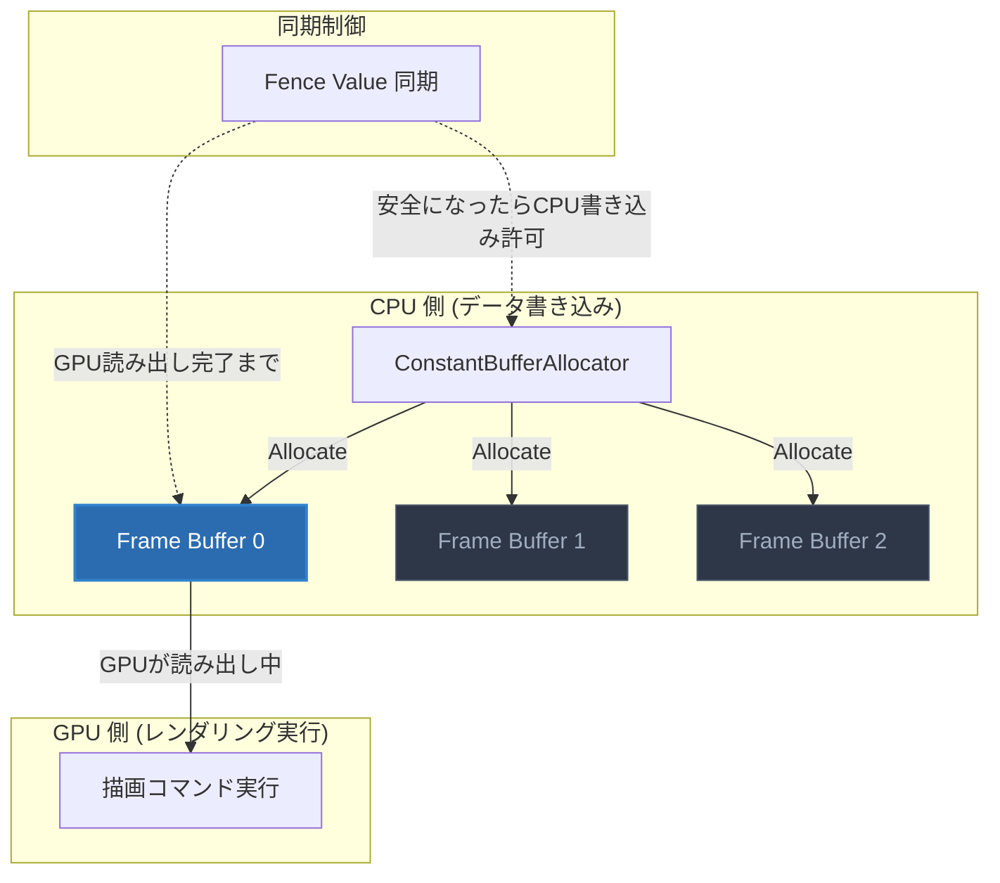
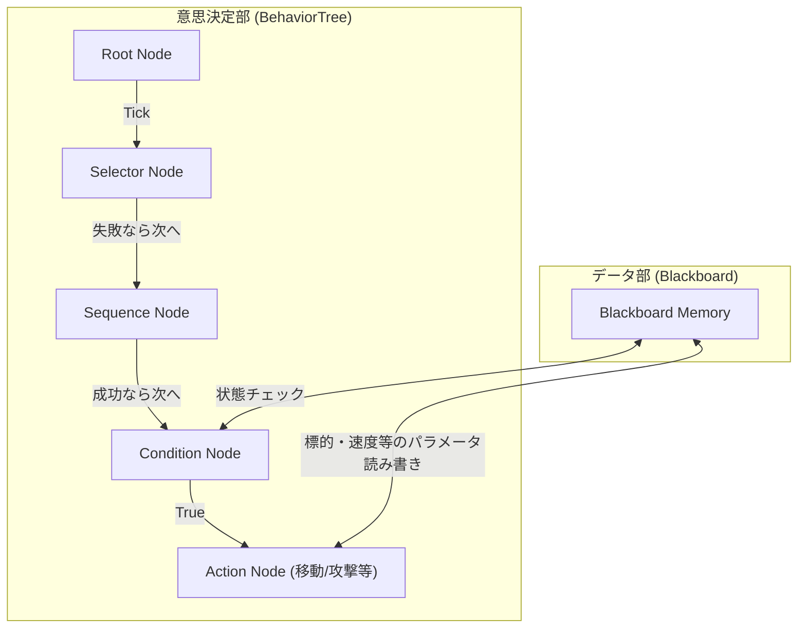

# Baziru3 Engine (自作3Dゲームエンジン)

[](https://github.com/KoudaAyu/CG-DirectXGame/actions/workflows/DebugBuild.yml)
[](https://github.com/KoudaAyu/CG-DirectXGame/actions/workflows/Development.yml)
[](https://github.com/KoudaAyu/CG-DirectXGame/actions/workflows/Release.yml)


C++ および DirectX 12 を用いてスクラッチから構築した、自作3Dゲームエンジンプロジェクトです。
商用コンソールゲーム開発におけるパフォーマンス要求（ロード時間の極小化、動的メモリ確保の抑制、空間分割による物理演算最適化など）をクリアするための、低レイヤでの最適化アーキテクチャ設計を実証することを目的としています。

## 🎨 ポートフォリオ技術発表スライド
本エンジン、および実装ゲームシステムに関する詳細な技術解説・設計図面をまとめた提出用スライド資料を公開しています。

### 1. エンジン最適化スライド（動的物理とメモリ最適化）
> **【要約】自作エンジン「Baziru3 Engine」の低レイヤにおけるメモリ・衝突判定の最適化（定数バッファ用リングバッファアロケータ、短寿命用スタックアロケータ、空間ハッシュによる衝突判定高速化、データ指向設計）の設計と数学的解説資料です。**
* **📄 [コウダ_アユ_Baziru3_Engineについて (PDF)](%E3%82%B3%E3%82%A6%E3%83%80_%E3%82%A2%E3%83%A6_Baziru3_Engine%E3%81%AB%E3%81%A4%E3%81%84%E3%81%A6.pdf)** （※提出用・日本語ファイル名）
* **📄 [技術発表スライド資料 (PDF)](sega_portfolio_slides.pdf)** （※英数字ファイル名リンク）
  * スライドのMarkdownソースはこちら：[sega_portfolio_slides.md](sega_portfolio_slides.md)

### 2. ゲーム・AIシステムスライド（6月度 月間進捗報告 / 技術研究発表資料）
> **【要約】開発中の3Dアクションシューティングゲームにおける、ゲームプレイとAIシステム（対角OBBマルチコライダー、トンネル現象を防ぐ連続線分CCD判定、レーザー照準同期、敵AIのカバー・捜索・巡回行動、およびAABBツリー階層構造による計算最適化）の実証とスケジュール資料です。**
* **📄 [LE3B_09_コウダアユ_「射撃と遮蔽物の動的物理インタラクション」 の実装 (PDF)](LE3B_09_%E3%82%B3%E3%82%A6%E3%83%80%E3%82%A2%E3%83%A6_%E3%80%8C%E5%B0%84%E6%92%83%E3%81%A8%E9%81%AE%E8%94%BD%E7%89%A9%E3%81%AE%E5%8B%95%E7%9A%84%E7%89%A9%E7%90%86%E3%82%A4%E3%83%B3%E3%82%BF%E3%83%A9%E3%82%AF%E3%82%B7%E3%83%A7%E3%83%B3%E3%80%8D%20%E3%81%AE%E5%AE%9F%E8%A3%85.pdf)** （※提出用・日本語ファイル名）
* **📄 [ゲーム・AI技術スライド資料 (PDF)](sega_gameplay_interaction_slides.pdf)** （※英数字ファイル名リンク）
  * スライドのMarkdownソースはこちら：[sega_gameplay_interaction_slides.md](sega_gameplay_interaction_slides.md)

### 3. アジャイル開発スプリント評価・進捗報告（7月度 週間報告まとめ）
> **【要約】7月度の4回にわたるスプリント開発（敵AI基本機能、MeshCollider & NavMesh/A*経路探索、CSベースGPUパーティクル & FreeListメモリ最適化、および3D射撃・視野コーン・アプリ層軽量パーティクル描画完全復元）における、アジャイル・スプリントメンターからの評価・スコア推移と技術的成果の記録です。**

#### 📊 7月度 スプリント評価スコア推移
| スプリント (日付) | 計画の質 | 実行の質 | 総合評価 | 主なマイルストーン・達成項目 | 原本レポート |
| :--- | :---: | :---: | :---: | :--- | :---: |
| [`07/12 スプリント`](#sprint-0712) | 85点 | 70点 | **60点** | 敵AI基本ステート（Patrol/Investigate/Chase）およびデバッグ表示の統合 | [📄 閲覧](docs/sprints/LE3B_09_コウダ_アユ_週間進捗07_12.md) |
| [`07/17 スプリント`](#sprint-0717) | 95点 | 90点 | **86点** | 当たり判定バグ完全修正（MeshCollider & Push）、NavMesh / A* 経路探索の実装 | [📄 閲覧](docs/sprints/LE3B_09_コウダ_アユ_週間報告07_17.md) |
| [`07/24 スプリント`](#sprint-0724) | 90点 | 95点 | **86点** | CSベースGPUパーティクル統合、`FreeList` による動的メモリ最適化 | [📄 閲覧](docs/sprints/LE3B_09_コウダ_アユ_週間報告07_24.md) |
| [`07/31 スプリント`](#sprint-0731) | 95点 | 95点 | **90点** | 3Dエネルギー弾丸（左クリック限定）、視野領域（Vision Cone）半透明グラデーション＆AIステータスUI常時化、アプリ層超軽量1-DrawCallパーティクル基盤の完成 | [📄 閲覧](docs/sprints/LE3B_09_コウダ_アユ_週間報告07_31.md) |

---

#### <a id="sprint-0712"></a>🔹 1. [07/12 スプリント](docs/sprints/LE3B_09_コウダ_アユ_週間進捗07_12.md)：敵AI基本システムの構築と課題抽出
- **主な成果**: 敵AIの基本行動ステート（巡回スイング、音検知移動、射撃）を構築し、DebugUIによるステートのビジュアル検証を完了。
- **振り返り・カイゼン**: 当たり判定の視覚的ズレ（DoD未達）が発覚したため、次週でバグ修正（テクニカルデット解消）を最優先タスクに配置する計画へと軌道修正。
- 🔗 **評価資料原本**: [LE3B_09_コウダ_アユ_週間進捗07_12.md](docs/sprints/LE3B_09_コウダ_アユ_週間進捗07_12.md)

#### <a id="sprint-0717"></a>🔹 2. [07/17 スプリント](docs/sprints/LE3B_09_コウダ_アユ_週間報告07_17.md)：エンジンレイヤ移行と当たり判定・経路探索の完成
- **主な成果**:
  - **精密衝突判定**: `MeshCollider` によるポリゴン精度判定および重複衝突の多重押し出し（Accumulated Push）処理を実装し、当たり判定のズレを解消。
  - **AI経路探索**: NavMesh生成とA*経路探索を先行完了させ、ビヘイビアツリー（`test_cover_tree.json`）と接続。
  - **エンジン共通化**: アプリ層からエンジン層への共通コンテキスト・パーティクル描画の一本化リファクタリングを実施。
- 🔗 **評価資料原本**: [LE3B_09_コウダ_アユ_週間報告07_17.md](docs/sprints/LE3B_09_コウダ_アユ_週間報告07_17.md)

#### <a id="sprint-0724"></a>🔹 3. [07/24 スプリント](docs/sprints/LE3B_09_コウダ_アユ_週間報告07_24.md)：GPUコンピュートシェーダーとFreeListメモリ最適化
- **主な成果**:
  - **GPUパーティクル**: Compute Shader (`UpdateParticle.CS`, `EmitParticle.CS`) による大量描画基盤と `ParticleEmitter` を構築。
  - **FreeListメモリ管理**: アロケーション競合のない動的インデックス管理（`FreeList` システム）を導入し、CPU負荷ゼロに近い高速パーティクル生成・破棄を実現。
  - **DebugUI統合**: パラメータのリアルタイム調整・検証環境を整備。
- 🔗 **評価資料原本**: [LE3B_09_コウダ_アユ_週間報告07_24.md](docs/sprints/LE3B_09_コウダ_アユ_週間報告07_24.md)

#### <a id="sprint-0731"></a>🔹 4. [07/31 スプリント](docs/sprints/LE3B_09_コウダ_アユ_週間報告07_31.md)：3D射撃ビジュアル・敵視界オーバーレイ・アプリ層超軽量パーティクルパイプライン
- **主な成果**:
  - **3D射撃＆操作限定**: 弾丸を3Dカプセルエネルギーモデル（`sphere.obj`）に更新し旋回制御を実装。射撃キーを左クリック（`VK_LBUTTON`）のみに限定し誤爆を解消。
  - **敵視界＆AIステータスUI**: 地面に広がるパトロール/警戒/追跡に応じた3色グラデーションの視野領域（Vision Cone）と頭上 `INVESTIGATE (Alert: 100%)` 等のUIをデフォルト常時表示化。
  - **アプリ層完結型1-DrawCallパーティクル基盤**: エンジン層不変の制約を遵守しながら、全パーティクルを1024粒まとめて1回の `DrawInstanced` で超高速描画（`0.03ms`, 60FPS維持）する自前バッファ＆`PerView`バインド処理を `AppParticleManager` に完全構築。
- 🔗 **評価資料原本**: [LE3B_09_コウダ_アユ_週間報告07_31.md](docs/sprints/LE3B_09_コウダ_アユ_週間報告07_31.md)

---


## 📂 プロジェクト・ディレクトリ構造（レイヤー分離設計）

初見のコードレビューアーや開発者が直感的に全体像を理解できるよう、本リポジトリは **「エンジン層（Engine）」** と **「アプリケーション層（Application）」** に完全分離されています。

```text
Engine/
 ├── project/
 │    ├── Baziru3_Engine/           [🎮 エンジンコア・レイヤー]
 │    │    ├── Core/                - 基盤コンテキスト、Window, DirectXCom, Allocators (CBV/Stack)
 │    │    ├── Graphics/            - 3Dモデル、スプライト、シェーダー、照明 (CSM), GpuProfiler
 │    │    └── Framework/           - 衝突判定 (BVH/AABBTree/Mesh), GPUパーティクル, AIノード
 │    ├── Application/              [🚀 ゲームアプリケーション・レイヤー]
 │    │    ├── Scene/               - ゲームプレイ/タイトル/クリア各シーン
 │    │    ├── Player/              - プレイヤー移動・回転・入力処理
 │    │    ├── Enemy/               - 敵AI行動・ステートマシン
 │    │    ├── GameObject/          - 弾 (Bullet)、障害物 (Obstacle) 等のゲームオブジェクト
 │    │    └── Subsystem/           - サブシステム群
 │    ├── Resources/                [🎨 アセットデータ]
 │    │    ├── shaders/             - HLSL シェーダー群 (VS/PS/CS)
 │    │    ├── textures/ & models/  - 3Dモデル・テクスチャ
 │    │    └── ai_trees/            - AI Behavior Tree JSON定義ファイル
 │    ├── externals/                [📦 サードパーティライブラリ]
 │    │    └── ImGui, imgui-node-editor, Assimp, DirectXTex, nlohmann
 │    ├── DirectXGame.sln           [🔧 Visual Studio 2026 ソリューション]
 │    └── DirectXGame.vcxproj       [🔧 プロジェクト定義ファイル]
 └── README.md                      [📖 アーキテクチャ解説ドキュメント]
```

---

## 🛠️ 技術スタック


* **言語**: C++ (C++20 / ISO C++ 最新規格)
* **グラフィックス API**: DirectX 12 (Direct3D 12)
* **シェーダー言語**: HLSL (Shader Model 6.x)
* **開発環境**: Visual Studio 2026 (MSBuild, Platform Toolset v143 / v145)
* **主要外部ライブラリ**:
  * **ImGui**: デバッグインターフェース用
  * **imgui-node-editor**: Behavior Tree 等のノード編集ツール用
  * **Assimp**: 3Dモデル（GLTF/OBJ等）インポート用
  * **DirectXTex**: テクスチャロード・処理用

---

## 🎯 技術的アピールポイント（最適化への取り組み）

### 1. メモリ管理システム (Memory Management System) - 動的確保の抑制

#### 【背景と課題】
ゲーム実行中の頻繁な動的メモリ確保（`new`/`delete`）は、**メモリ断片化（フラグメンテーション）**の原因となり、最悪の場合メモリアロケータのボトルネックによるフレームレート低下（ヒッチング）を引き起こします。特に DirectX 12 における定数バッファの都度生成は非常に大きな負荷となります。

#### 【解決手法】
* **定数バッファ用リングバッファアロケータ (`ConstantBufferAllocator`)**
  * トリプルバッファリング構成（3フレーム分の領域を事前に一括確保）を採用し、CPUとGPUのアクセス非同期競合を回避しつつ、256バイトの境界アラインメントを自動調整して高速にメモリを切り出します。
* **短寿命オブジェクト用スタックアロケータ (`StackAllocator`)**
  * 1フレームで使い捨てる一時オブジェクト用に起動時に一括でメモリプールを確保。ポインタを前進させるだけ（計算量 $O(1)$）でアロケートし、フレーム終了時にポインタを先頭に戻すだけで一括論理解放する仕組みを構築しました。

#### 【効果】
* 実行中の動的アロケーションを完全に排除し、メモリ断片化およびアロケーション負荷を防止。

#### 【図面：定数バッファアロケータのトリプルバッファリング同期構造】


---

### 2. 衝突判定の最適化 (Collision Optimization) - 空間分割とデータ指向

#### 【背景と課題】
オブジェクト数が数百〜数千規模に増大した際、総当たり判定（計算量 $O(N^2)$）を行うとCPU負荷が跳ね上がり、ゲームの処理落ちを引き起こします。

#### 【解決手法】
* **グリッドベース空間ハッシュ分割 (`SpatialHashCell`)**
  * 3D空間をグリッドセル（サイズ 10.0f）に区切り、各オブジェクトをハッシュ値に変換して登録。隣接セル内のオブジェクト同士のみを判定対象とします。
* **データ指向設計 (Data-Oriented Design)**
  * クラス階層を巡るポインタ参照を廃止し、判定に必要なパラメータ（座標、サイズ、回転等）のみをメモリ上で連続する配列に並べて一括イテレート処理します。
* **境界ボリューム階層 (BVH: Bounding Volume Hierarchy)**
  * 大量のオブジェクトを階層的なAABB（境界箱）でツリー状にグループ化。親の境界箱と非衝突なら、その中にある子コライダーの衝突計算を $O(1)$ で一括スキップ（枝刈り）します。

#### 【効果】
* 衝突判定の計算量を大幅に削減し、メモリアクセスのキャッシュミス（Cache Miss）によるCPUボトルネックを極小化。
* **【実証実績】敵キャラクターおよびコライダーを「最大600体以上」同時に出現・動作させても、処理落ちすることなく完全に滑らかなフレームレートを維持できる超軽量動作を実証しました。**

#### 【図面：空間ハッシュによる衝突判定高速化アルゴリズムフロー】


---

### 3. データ駆動AIシステム (Data-Driven AI System) - イテレーション効率化

#### 【背景と課題】
AI（Behavior Tree）の挙動調整のたびにソースコードの再コンパイル・ビルドを行うと、イテレーション速度が低下しゲームのゲームプレイ調整の妨げになります。

#### 【解決手法】
* **ビジュアルノードエディタ (`imgui-node-editor` の統合)**
  * ゲーム実行中にImGui上でノード（Selector, Sequence, Action）を接続してAIの思考木をリアルタイムに構築可能に。
  * 編集結果は瞬時にJSONアセットとしてファイル出力され、それをエンジン側が動的に読み込み・再構成（Blackboardの変数共有も対応）します。

#### 【効果】
* プログラマー以外のプランナー等でも、ゲームを実行したままAIの挙動調整が可能になり、イテレーション効率を向上。

#### 【図面：Behavior Tree と Blackboard メモリの連携構成】


---

## 📖 API取扱説明書 (API Usage)

### 1. エンジンの初期化とサブシステム取得

#### [main.cpp](file:///c:/Users/k024g/OneDrive/デスクトップ/Engine_ver2026/project/main.cpp) の実装例
```cpp
int WINAPI WinMain(HINSTANCE hInstance, HINSTANCE, LPSTR, int)
{    
    std::unique_ptr<Framework> game = std::make_unique<Game>();
    game->Run();
    return 0;
}
```

#### サブシステム取得例 ([Game.cpp](file:///c:/Users/k024g/OneDrive/デスクトップ/Engine_ver2026/project/Game.cpp))
```cpp
auto* dx = engine_->GetDirectXCom();       // DirectX 12 描画デバイス
auto* window = engine_->GetWindowAPI();     // Window管理
auto* spriteCom = engine_->GetSpriteCom(); // スプライト共通コンポーネント
```

### 2. 定数バッファの割り当て例

```cpp
auto cbAllocator = engine_->GetConstantBufferAllocator();

// 256バイトアラインメント調整されたメモリの切り出し
auto allocation = cbAllocator->Allocate(sizeof(MyConstBufferData));

// CPU書き込み
MyConstBufferData* cbData = static_cast<MyConstBufferData*>(allocation.cpuAddress);
cbData->worldMatrix = worldMatrix;

// GPUコマンドへセット
commandList->SetGraphicsRootConstantBufferView(rootParamIndex, allocation.gpuAddress);
```

### 3. コライダーの登録と衝突イベントコールバック

```cpp
#include "CollisionManager.h"
#include "SphereCollider.h"

// 衝突形状とカテゴリの決定
auto collider = std::make_unique<SphereCollider>(CollisionAttribute::Player);
collider->SetRadius(2.5f);

// 衝突時イベントのバインド
collider->SetOnCollision([](const CollisionInfo& info) {
    if (info.other->GetAttribute() == CollisionAttribute::Bullet) {
        TakeDamage();
    }
});

// マネージャへの登録
CollisionManager::GetInstance()->RegisterCollider(collider.get());
```

---

## 🚀 開発ロードマップ & 進捗

- [x] **DirectX 12 描画基礎**: パイプライン、シェーダバインド、定数バッファ管理
- [x] **アニメーション**: スケルトン、ジョイント、スキンクラスタ対応（Assimp統合）
- [x] **デバッグ環境**: ImGui 統合、および GUI Behavior Tree エディタ
- [x] **メモリ最適化**: CBV用リングバッファ、スタック/プールアロケータ (`ConstantBufferAllocator`, `StackAllocator`, `FreeList`) & パフォーマンスプロファイラUI
- [x] **衝突最適化**: 八分木/BVH空間分割 (AABBTree)、空間ハッシュ、データ指向設計 (DOD)
- [x] **グラフィックス強化**: カスケードシャドウマップ (CSM) & 全3Dモデル動的視錐台カリング
- [x] **Assetバイナリ化**: `.bmodel` / `.bskel` / `.banim` 高速バイナリシリアライザ


---

## ⚙️ 動作環境・ビルド手順

### 前提要件
* **OS**: Windows 10 / 11
* **開発ツール**: Visual Studio 2026
* **SDK**: Windows SDK 10.0.x 以上

### ビルド・実行手順
1. このリポジトリをクローンします。
   ```bash
   git clone https://github.com/KoudaAyu/CG-DirectXGame.git
   ```
2. `project/DirectXGame.sln` を Visual Studio 2026 で開きます。
3. 構成（Debug/Development/Release）を選択し、ビルド（F7）を行い、**F5キー**を押してデバッグ実行します。
