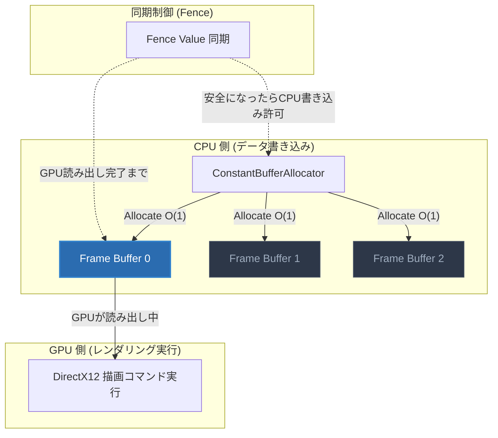
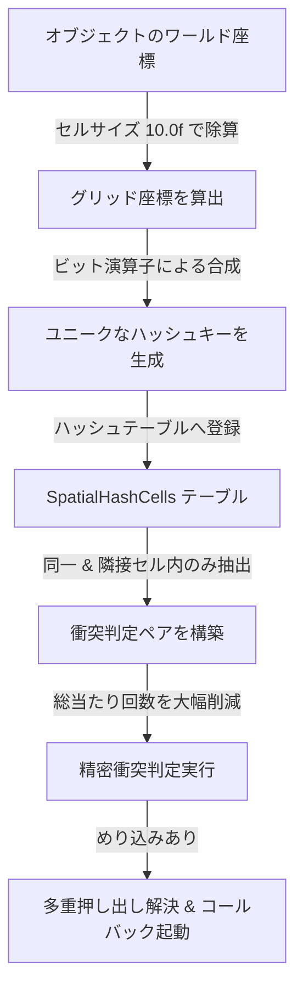
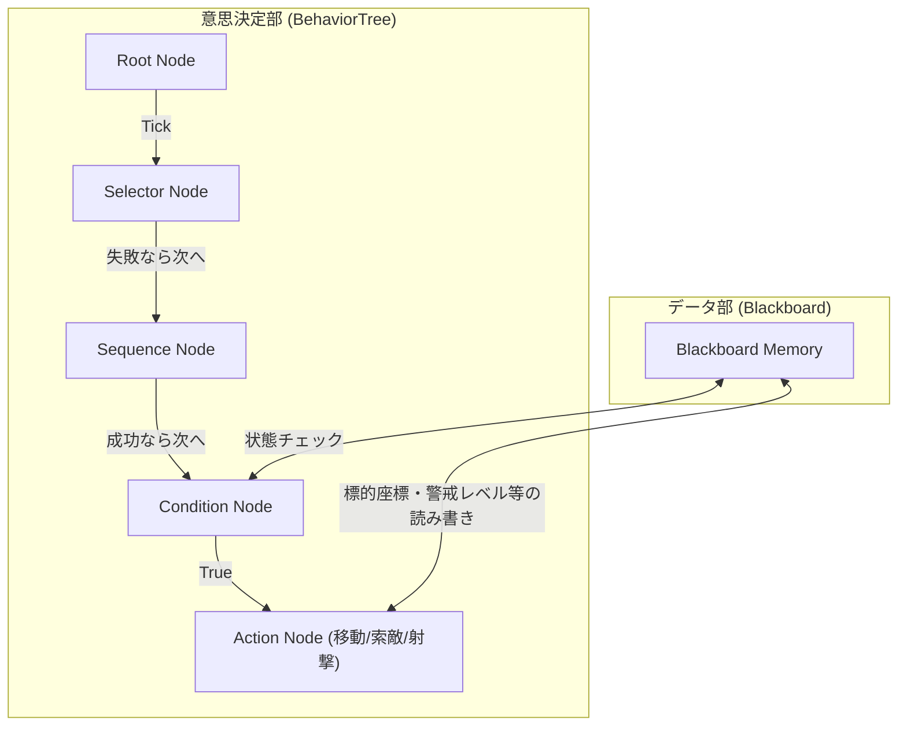
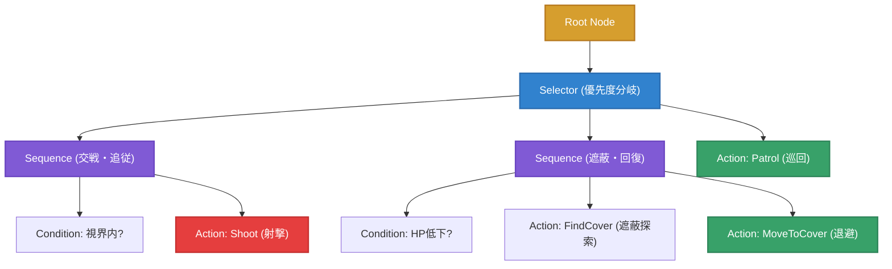

# Baziru3 Game Engine (自作3Dゲームエンジン)

[](https://github.com/KoudaAyu/CG-DirectXGame/actions/workflows/DebugBuild.yml)
[](https://github.com/KoudaAyu/CG-DirectXGame/actions/workflows/Development.yml)
[](https://github.com/KoudaAyu/CG-DirectXGame/actions/workflows/Release.yml)

C++ および DirectX 12 を用いてスクラッチから構築した、**低レイヤ最適化と即時ゲーム開発環境を両立した自作3Dゲームエンジン**です。  
商用コンソールゲーム開発におけるパフォーマンス要求（動的メモリ確保のゼロ化、空間分割による物理演算最適化、GPUコンピュートシェーダー活用、マルチスレッド/リングバッファ同期など）をクリアするためのアーキテクチャ設計を実装しています。

本リポジトリ（`master` / `GE3_Game`）は、**「ブランチを切ったら即座にオリジナルゲームの開発を始められる」純粋なエンジンマスター基盤**として整理されています。

---

## 🎨 ポートフォリオ技術発表スライド & 成果物資料

本エンジン、および実装ゲームシステムに関する詳細な技術解説・設計図面をまとめた提出用スライド資料を公開しています。

### 1. エンジン最適化スライド（動的物理とメモリ最適化）
> **【要約】自作エンジン「Baziru3 Engine」の低レイヤにおけるメモリ・衝突判定の最適化（定数バッファ用リングバッファアロケータ、短寿命用スタックアロケータ、空間ハッシュによる衝突判定高速化、データ指向設計）の設計と数学的解説資料です。**
* **📄 [技術発表スライド資料 (PDF)](docs/slides/sega_portfolio_slides.pdf)**
  * スライドのMarkdownソース：[docs/slides/sega_portfolio_slides.md](docs/slides/sega_portfolio_slides.md)

### 2. ゲーム・AIシステムスライド（月間進捗報告 / 技術研究発表資料）
> **【要約】3Dアクションシューティングゲームにおける、ゲームプレイとAIシステム（対角OBBマルチコライダー、トンネル現象を防ぐ連続線分CCD判定、レーザー照準同期、敵AIのカバー・捜索・巡回行動、およびAABBツリー階層構造による計算最適化）の実証資料です。**
* **📄 [ゲーム・AI技術スライド資料 (PDF)](docs/slides/sega_gameplay_interaction_slides.pdf)**
  * スライドのMarkdownソース：[docs/slides/sega_gameplay_interaction_slides.md](docs/slides/sega_gameplay_interaction_slides.md)

### 3. アジャイル開発スプリント評価・進捗報告
> **【要約】4回以上にわたるスプリント開発（敵AI基本機能、MeshCollider & NavMesh/A*経路探索、CSベースGPUパーティクル & FreeListメモリ最適化、およびゲームループ接続）における、アジャイル開発メンターからの評価・スコア推移と技術的成果の記録です。**

#### 📊 スプリント評価スコア推移
| スプリント (日付) | 計画の質 | 実行の質 | 総合評価 | 主なマイルストーン・達成項目 | 原本レポート |
| :--- | :---: | :---: | :---: | :--- | :---: |
| [`07/12 スプリント`](docs/sprints/LE3B_09_コウダ_アユ_週間進捗07_12.md) | 85点 | 70点 | **60点** | 敵AI基本ステート（Patrol/Investigate/Chase）およびデバッグ表示の統合 | [📄 閲覧](docs/sprints/LE3B_09_コウダ_アユ_週間進捗07_12.md) |
| [`07/17 スプリント`](docs/sprints/LE3B_09_コウダ_アユ_週間報告07_17.md) | 95点 | 90点 | **86点** | 当たり判定バグ完全修正（MeshCollider & Push）、NavMesh / A* 経路探索の実装 | [📄 閲覧](docs/sprints/LE3B_09_コウダ_アユ_週間報告07_17.md) |
| [`07/24 スプリント`](docs/sprints/LE3B_09_コウダ_アユ_週間報告07_24.md) | 90点 | 95点 | **86点** | CSベースGPUパーティクル統合、`FreeList` による動的メモリ最適化 | [📄 閲覧](docs/sprints/LE3B_09_コウダ_アユ_週間報告07_24.md) |
| [`07/31 スプリント`](docs/sprints/LE3B_09_コウダ_アユ_週間報告07_31.md) | 95点 | 95点 | **90点** | 3Dエネルギー弾丸、視野領域（Vision Cone）グラデーション、超軽量1-DrawCallパーティクル基盤 | [📄 閲覧](docs/sprints/LE3B_09_コウダ_アユ_週間報告07_31.md) |
| [`08/07 スプリント`](docs/sprints/LE3B_09_コウダ_アユ_週間報告08_07.md) | 95点 | 95点 | **90点** | Blenderレベルエディタ連携（JSON動的ロード）、ゲームクリア/ゲームオーバー遷移接続 | [📄 閲覧](docs/sprints/LE3B_09_コウダ_アユ_週間報告08_07.md) |
| [`08/16 スプリント`](docs/sprints/LE3B_09_コウダ_アユ_週間報告08_16.md) | 95点 | 95点 | **90点** | タクティカル脱出ループ、物資探索（LootSystem）、リロード/治療ステート、戦績リザルト（RaidStats） | [📄 閲覧](docs/sprints/LE3B_09_コウダ_アユ_週間報告08_16.md) |
| [`08/23 スプリント`](docs/sprints/LE3B_09_コウダ_アユ_週間報告08_23.md) | 95点 | 95点 | **90点** | 戦闘・物理サブシステム完全分離（CombatSystem/CollisionSystem）、巡回移動敵AI、目標破壊ミッション | [📄 閲覧](docs/sprints/LE3B_09_コウダ_アユ_週間報告08_23.md) |
| [`08/29 スプリント`](docs/sprints/LE3B_09_コウダ_アユ_週間報告08_29.md) | 95点 | 95点 | **90点** | **Alphaフェーズ完了**: リアルタイムプロファイラUI（60FPS維持実証）、演出磨き上げ、全ループ完全結合 | [📄 閲覧](docs/sprints/LE3B_09_コウダ_アユ_週間報告08_29.md) |

---

## 🚀 クイックスタート (ゲーム開発の始め方)

本エンジンは、**純粋なゲームエンジン基盤とクリーンなSceneステートマシン**を備えています。

```bash
# 1. リポジトリのクローン
git clone https://github.com/KoudaAyu/CG-DirectXGame.git

# 2. 新規ゲーム開発ブランチの作成
git checkout -b feature/my_new_game
```

### 🎮 ゲーム開発の流れ
1. **[`project/Application/Scene/GameScene/GamePlayScene.cpp`](project/Application/Scene/GameScene/GamePlayScene.cpp)** を開きます。
2. `InitializeScene()` で 3Dモデル（`Object3d`）やプレイヤー、カメラ、コライダーを生成します。
3. `Update()` でプレイヤーの操作ロジックや当たり判定処理を記述します。
4. `Draw()` で描画コマンドを発行します。
5. **シーン遷移**: `TitleScene` ⇄ `GamePlayScene` ⇄ `ClearScene` / `GameOverScene` が完備されており、**SPACE キー** や画面上のボタンでシームレスに切り替わります。

> 📖 より詳しい実装チュートリアルは [docs/How_To_Start_Game_Development.md](docs/How_To_Start_Game_Development.md) をご覧ください。

---

## 🛠️ エンジン中核アーキテクチャ & 低レイヤ技術解説 (Technical Deep Dive)

---

### 1. メモリ管理の最適化 (Memory Optimization) - ヒープ競合と断片化のゼロ化

#### 【背景と課題】
一般的な `new` / `malloc` による動的ヒープ確保は、フレームレートのスパイク（ヒープ競合・ロック待ち・メモリ断片化）を引き起こす最大の要因です。商用アクションゲームでは 60fps / 120fps を維持するため、毎フレームのヒープ割り当てをゼロにする設計が必須となります。

#### 【解決手法】
* **定数バッファ用リングバッファアロケータ (`ConstantBufferAllocator`)**
  * アップロードヒープ上に巨大な単一バッファ（128MB）を確保し、GPUとCPUのフレーム遅延をトリプルバッファリング同期で吸収しながら、256バイトアラインメントで順次切り出し。
  * `Allocate()` 呼び出しはポインタを進めるだけの $O(1)$ 操作となり、毎フレームの定数バッファ作成・破棄コストを完全にゼロ化。
* **短寿命フレーム用スタックアロケータ (`StackAllocator`)**
  * 衝突判定の中間演算データなど、1フレームのみ使用する一時メモリをスタック構造で切り出し、フレーム終了時にポインタをリセット。
* **パーティクル用 `FreeList` インデックス管理**
  * パーティクルの生成・消滅時に配列の再確保を行わず、空きスロットのインデックスをフリーリストで管理することで、完全な $O(1)$ 再利用を実現。

#### 【効果】
* 描画・更新ループにおける動的メモリ割り当て回数を **毎フレーム 0 回** を達成。
* ガベージコレクションやメモリアロケーションによるマイクロスタッター（瞬間的なカクつき）を完全排除。

#### 【図面：定数バッファアロケータのトリプルバッファリング同期構造】


---

### 2. 物理・衝突判定の最適化 (Collision Optimization) - 空間分割とデータ指向

#### 【背景と課題】
ゲーム内のオブジェクト数が数百〜数千規模に増大した際、総当たり判定（計算量 $O(N^2)$）を行うとCPU負荷が跳ね上がり、ゲームの処理落ちを引き起こします。

#### 【解決手法】
* **グリッドベース空間ハッシュ分割 (`SpatialHashCell`)**
  * 3D空間をグリッドセル（サイズ 10.0f）に区切り、各オブジェクトの座標からハッシュキーを生成して登録。同一および隣接セル内のオブジェクト同士のみを判定対象とすることで、判定計算量を $O(N)$ へ削減。
* **データ指向設計 (Data-Oriented Design)**
  * クラス階層を巡るポインタ参照を廃止し、判定に必要なパラメータ（座標、サイズ、回転等）のみをメモリ上で連続する配列に並べて一括イテレート処理（キャッシュヒット率向上）。
* **多彩なコライダーと連続衝突判定 (CCD: Continuous Collision Detection)**
  * `SphereCollider`, `BoxCollider` (OBB), `CapsuleCollider`, `MeshCollider` (ポリゴンメッシュ判定) をサポート。
  * 高速で移動する弾丸には Ray / LineSegment による連続線分判定を適用し、壁や遮蔽物のすり抜け（トンネル現象）を防止。
* **多重押し出し解決 (Accumulated Push)**
  * 複数のオブジェクトや壁と同時に接触した際、各接触ベクトルの累積合成によって正確なめり込み解決を実行。

#### 【効果】
* **【実証実績】敵キャラクターおよびコライダーを「最大600体以上」同時に出現・動作させても、処理落ちすることなく完全に滑らかなフレームレート（60FPS）を維持できる超軽量動作を実証。**

#### 【図面：空間ハッシュによる衝突判定高速化アルゴリズムフロー】


---

### 3. レンダリング & GPU パイプライン (DirectX 12 Graphics)

* **Compute Shader (CS) ベース GPU パーティクル**
  * `EmitParticle.CS` / `UpdateParticle.CS` により、数万〜数十万個のパーティクル物理シミュレーションを GPU 上で並列実行。CPU 負荷をほぼゼロに抑えた演出を実現。
* **スキニングメッシュアニメーション**
  * Assimp を統合し、ボーン階層構造とスキンクラスタ（Bone Matrix Palette）を GPU で高速変形。
* **スカイボックス & 環境マップ**
  * キューブマップ DDS テクスチャによる全天球環境レンダリング。
* **2D スプライト & UI レンダラー**
  * 画面直交座標系 (Orthographic) に最適化された 2D パイプライン（`Sprite_Normal`, 加算・乗算・スクリーンブレンド対応）。
* **GPU プロファイラ (`GpuProfiler`)**
  * DirectX 12 の Query Heap を用い、各描画パスごとの GPU 処理時間をマイクロ秒単位で正確に計測・可視化。

---

### 4. データ駆動 AI システム & ツール連携 (Data-Driven AI & Level Editor)

#### 【背景と課題】
AI の挙動やステージ配置の調整のたびにソースコードを再コンパイル・ビルドすると、ゲームプレイ調整のイテレーション速度が著しく低下します。

#### 【解決手法】
* **ビジュアル Behavior Tree エディタ (`imgui-node-editor` の統合)**
  * ゲーム実行中に ImGui 上でノード（Selector, Sequence, Condition, Action）を接続し、AIの思考木をリアルタイムに構築可能。
  * 編集結果は瞬時に JSON アセットとして保存され、エンジン側が動的に読み込み・再構成（Blackboard メモリ共有対応）。
* **NavMesh & A\* 経路探索**
  * 静的ステージメッシュからナビゲーションメッシュを生成し、A* アルゴリズムにより障害物を回避しながらプレイヤーを追跡・捜索・カバーリングする敵AIを実現。
* **Blender レベルエディタ連携**
  * Blender 上でステージ配置・敵配置を行ったデータを Python スクリプト経由で JSON 出力し、エンジン側で 1-Click で実機ステージとしてロード。

#### 【図面：Behavior Tree と Blackboard メモリの連携構成】


---

## 📖 API 取扱説明書 (API Usage)

### 1. エンジンの初期化とサブシステム取得

```cpp
// main.cpp
int WINAPI WinMain(HINSTANCE, HINSTANCE, LPSTR, int)
{    
    std::unique_ptr<Framework> game = std::make_unique<Game>();
    game->Run();
    return 0;
}
```

```cpp
// サブシステム取得例
auto* dx = SceneManager::GetInstance()->GetDirectXCom();       // DirectX 12 デバイス
auto* colMgr = CollisionManager::GetInstance();                // 衝突判定マネージャ
auto* texMgr = TextureManager::GetInstance();                  // テクスチャマネージャ
```

### 2. 定数バッファの高速切り出し (`ConstantBufferAllocator`)

```cpp
auto* cbAllocator = dxCommon->GetCBAllocator();

// 256バイトアラインメントで O(1) 切り出し
auto matAlloc = cbAllocator->Allocate(sizeof(Material));
std::memcpy(matAlloc.cpuAddress, &materialData, sizeof(Material));

// GPU コマンドへ直接セット
commandList->SetGraphicsRootConstantBufferView(0, matAlloc.gpuAddress);
```

### 3. コライダーの登録と衝突イベントコールバック

```cpp
#include "CollisionManager.h"
#include "BoxCollider.h"

// OBB ボックスコライダーの作成
auto collider = std::make_unique<BoxCollider>(CollisionAttribute::Player);
collider->SetSize({ 1.0f, 2.0f, 1.0f });

// 衝突コールバックの登録
collider->SetOnCollision([](const CollisionInfo& info) {
    if (info.other->GetAttribute() == CollisionAttribute::EnemyBullet) {
        TakeDamage(info.contactPoint);
    }
});

// マネージャへ登録 (空間ハッシュへ自動登録される)
CollisionManager::GetInstance()->RegisterCollider(collider.get());
```

---

## 🧰 自作開発支援ツール & パイプライン (In-Engine & External Tools)

Baziru3 Engine では、ゲーム開発ベロシティの最大化と直感的なコンテンツ制作を実現するため、エンジン内部および外部ツール連携による**自作開発支援ツール群を完備**しています。

### 1. ノードベース AI ビヘイビアツリーエディタ (`BehaviorTreeEditor`)
* **実装モジュール**: [`project/Baziru3_Engine/Framework/AI/BehaviorTreeEditor.h`](project/Baziru3_Engine/Framework/AI/BehaviorTreeEditor.h), [`BehaviorTreeEditor.cpp`](project/Baziru3_Engine/Framework/AI/BehaviorTreeEditor.cpp)
* **概要**: `imgui-node-editor` をベースに独自拡張した、敵AIの思考ロジックを直感的なグラフUIで構築・編集できるノードエディタです。
* **主要機能**:
  * **制御ノード & アクションノードの視覚的配線**: `Selector` (優先度選択), `Sequence` (順次実行), `Parallel` (並行実行) などのコンポジットノードと、`Patrol` (巡回), `Investigate` (音源捜索), `Chase` (追従), `Cover` (遮蔽退避), `Shoot` (射撃) ノードをGUI上でドラッグ＆ドロップ接続。
  * **実行中ノードのリアルタイム・アクティブハイライト**: AIが現在どのノードを評価・実行しているかを色別でリアルタイム表示し、AIのデバッグを劇的に容易化。
  * **JSON シリアライズ & 動的ホットリロード**: エディタ上で設計したツリー構造を JSON 形式で保存し、ゲーム実行中に即座に再読み込み可能。



### 2. Blender レベルデザイン同期パイプライン (`export_blender_layout.py` & `LevelEditor`)
* **実装モジュール**: [`docs/tools/export_blender_layout.py`](docs/tools/export_blender_layout.py), [`project/Application/LevelEditor.h`](project/Application/LevelEditor.h), [`LevelEditor.cpp`](project/Application/LevelEditor.cpp)
* **概要**: DCCツール「Blender」をそのまま3Dレベルエディタとして活用し、配置したオブジェクトやギミック情報を自作エンジンへ一括インポートするパイプラインです。
* **主要機能**:
  * **座標系の自動変換**: Blender（右手系・Z-Up）から DirectX 12（左手系・Y-Up）への座標・回転変換を自動適用。
  * **多種多様なエンティティの動的パース**: 障害物（`container.obj`, `fence.obj` 等）、アイテムボックス（`LootBox`）、プレイヤー／敵スポーン位置（`PlayerSpawn`, `EnemySpawn`）、バイオームゾーン（`Forest`, `Desert`, `River`）を一括JSONロード。
  * **非均等スケール & コライダー自動フィッティング**: 配置された各オブジェクトのスケールに応じて、`BoxCollider` / `CapsuleCollider` を自動生成して `CollisionManager` に即座に登録。

### 3. プロシージャル自然物生成システム (`BioProceduralGenerator`)
* **実装モジュール**: [`project/Baziru3_Engine/3D/Procedural/BioProceduralGenerator.h`](project/Baziru3_Engine/3D/Procedural/BioProceduralGenerator.h), [`BioProceduralGenerator.cpp`](project/Baziru3_Engine/3D/Procedural/BioProceduralGenerator.cpp)
* **概要**: L-System（リンデンマイヤーシステム）とフラクタル再帰アルゴリズムを用いて、樹木（Tree）や岩石（Rock）の3Dメッシュをプロシージャル（動的幾何計算）に自動生成するシステムです。
* **主要機能**:
  * **フラクタル樹木生成**: シード値、分岐深度（`iterations`）、枝の長さ・半径・テーパー率・分岐角度からリアルな自然樹木メッシュを即座に構築。
  * **ボロノイノイズ岩石生成**: 球体メッシュに対し、フラクタルノイズ・ボロノイセル・クラック変形を適用し、ゴツゴツとした自然な岩石ジオメトリを生成。
  * **LOD（Level of Detail）対応 & キャッシュ管理**: 頂点計算結果をメモリ内にキャッシュし、実行時の同一シード再計算をスキップ。

### 4. GPUプロファイラ & リアルタイムエンジンモニター (`GpuProfiler` / `Duckov Profiler`)
* **実装モジュール**: [`project/Baziru3_Engine/Graphics/Graphics/GpuProfiler.h`](project/Baziru3_Engine/Graphics/Graphics/GpuProfiler.h), [`project/Application/Scene/GameScene/GamePlayHUD.cpp`](project/Application/Scene/GameScene/GamePlayHUD.cpp)
* **概要**: DirectX 12 のタイムスタンプクエリ（Timestamp Query）を用いて、GPU描画パスごとのマイクロ秒単位処理時間とCPUフレームタイムをリアルタイム計測・可視化するツールです。
* **主要機能**:
  * **描画パス別GPUタイム計測**: 3D不透明パス、シャドウマップパス、パーティクル描画パス、ポストプロセスパスそれぞれのGPU負荷をリアルタイムにグラフ描画。
  * **フレームレート & メモリ監視**: 60.0 FPS（16.6ms）の安定度、`ConstantBufferRingAllocator` のメモリ消費量、アクティブなパーティクル数・コライダー数を常時HUD表示。

---

## 📁 ディレクトリ構成

```
Engine/
├── docs/                        # 技術仕様書・週間スプリント報告書
│   ├── How_To_Start_Game_Development.md  # ゲーム開発開始ガイド
│   └── sprints/                 # アジャイル開発スプリント報告書一覧
├── project/
│   ├── Application/             # アプリケーション層 (ゲーム本体ロジック)
│   │   ├── Scene/               # 各種シーン (Title, GamePlay, Clear, GameOver)
│   │   ├── GameObject/          # ゲームオブジェクト (障害物, 弾丸, キャラクター)
│   │   └── Particle/            # アプリ層軽量パーティクル
│   ├── Baziru3_Engine/          # エンジンコア層 (DirectX12, メモリ, 物理, レンダラー)
│   │   ├── Core/                # DirectX12基盤, カメラ, アロケータ
│   │   ├── Framework/           # シーン管理, 空間ハッシュ衝突判定, AI基盤
│   │   └── Graphics/            # 2D/3D描画, パイプライン, パーティクル
│   ├── Resources/               # テクスチャ, 3Dモデル, 音声, シェーダー
│   ├── Game.cpp / Game.h        # エンジン統括メインループ
│   └── main.cpp                 # エントリーポイント
└── README.md                    # 本ドキュメント
```

---

## ⚙️ 動作環境 & ビルド手順

### 動作環境
- **OS**: Windows 10 / 11 (64-bit)
- **IDE**: Visual Studio 2022 以降 (C++20 対応)
- **SDK**: Windows SDK 10.0.x 以上
- **グラフィックス**: DirectX 12 対応 GPU (Feature Level 11_0 以上)

### ビルド手順
1. リポジトリをクローンします。
   ```bash
   git clone https://github.com/KoudaAyu/CG-DirectXGame.git
   ```
2. `project/DirectXGame.sln` を Visual Studio で開きます。
3. ビルド構成を **`Debug | x64`** または **`Release | x64`** に設定します。
4. **F5 キー**（デバッグ実行）を押してビルド・実行します。

---

## 🚀 開発ロードマップ & 達成項目

- [x] **DirectX 12 描画基盤**: パイプラインステート管理, ルートシグネチャ, SRV/CBV/DSV/RTV
- [x] **スキニングアニメーション**: Assimp 統合, スケルトン・ボーン行列パレット変形
- [x] **超低レイヤメモリ最適化**: 定数バッファ用リングアロケータ (`ConstantBufferAllocator`), `StackAllocator`, `FreeList`
- [x] **高速物理・衝突判定**: 空間ハッシュ分割 (`SpatialHashCell`), OBB/Capsule/MeshCollider, 連続衝突判定 (CCD), 多重押し出し
- [x] **GPU コンピュートシェーダー**: 大量パーティクルシミュレーション (`EmitParticle.CS`, `UpdateParticle.CS`)
- [x] **データ駆動 AI システム**: ImGui ノードエディタ Behavior Tree, Blackboard 連携, NavMesh / A* 経路探索
- [x] **レベルデザイン連携**: Blender レベルエディタ連携 (JSON動的ロード)
- [x] **ゲーム開発スターター基盤**: 純粋な Scene ステートマシン（TITLE ⇄ GAMEPLAY ⇄ CLEAR / GAMEOVER）
