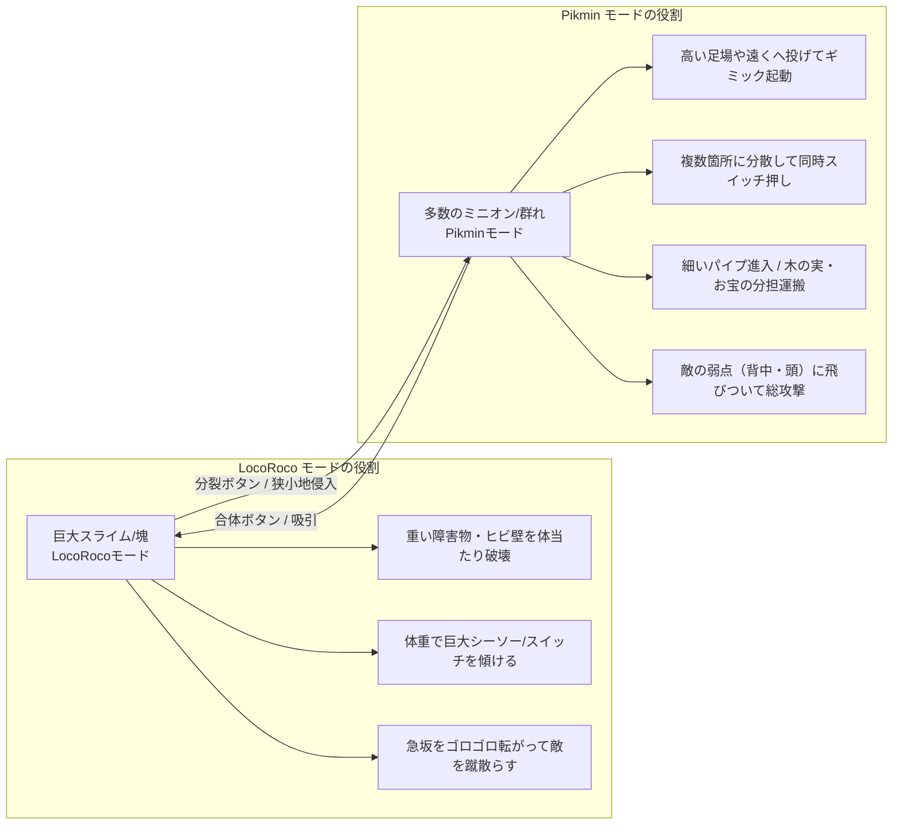
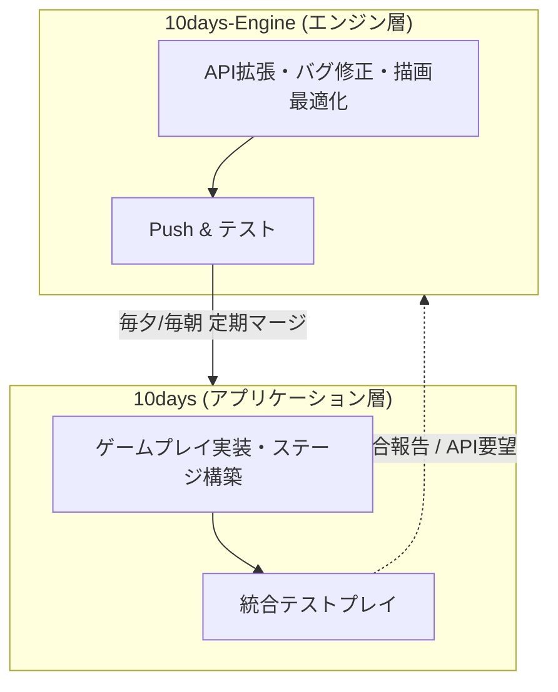

# 10日間 3Dゲーム制作ロードマップ & 開発仕様書
**プロジェクトテーマ**: 『ピクミン (Pikmin)』 × 『ロコロコ (LocoRoco)』 融合3Dアクションゲーム  
**ブランチ運用**: アプリケーション層 (`10days`) / エンジン層 (`10days-Engine`)

---

## 📑 目次
1. [ゲームコンセプト＆コアメカニクス](#1-ゲームコンセプトコアメカニクス)
2. [全体同期サイクル＆ブランチ運用方針](#2-全体同期サイクルブランチ運用方針)
3. [【アプリケーション層】10日間詳細ロードマップ (`10days`)](#3-アプリケーション層10日間詳細ロードマップ-10days)
4. [【エンジン層】10日間詳細ロードマップ (`10days-Engine`)](#4-エンジン層10日間詳細ロードマップ-10days-engine)
5. [推奨クラス設計＆チーム役割分担](#5-推奨クラス設計チーム役割分担)
6. [3D空間での技術的実装ポイント & Tips](#6-3d空間での技術的実装ポイント--tips)
7. [10日間で成功させるための開発鉄則](#7-10日間で成功させるための開発鉄則)

---

## 1. ゲームコンセプト＆コアメカニクス

### 💡 コンセプト：「塊（LocoRoco）」と「群れ（Pikmin）」のダイナミック切り替えアクション
プレイヤーはリーダー（または親玉）となり、多数の小型キャラクター（ミニオン）を引き連れて3Dステージを探索・攻略します。  
ボタン1つで**「1つの巨大な塊（合体）」**と**「多数の小型ユニット（分裂）」**を瞬時に切り替え、地形やギミックを解き明かします。



---

## 2. 全体同期サイクル＆ブランチ運用方針

### 🌿 ブランチの責務分離
* **`10days` ブランチ（アプリケーション層）**:
  * ゲームロジック、プレイヤー、ミニオン挙動、敵AI、ステージデータ、UI、カメラ、サウンド再生、エフェクトトリガーを実装。
* **`10days-Engine` ブランチ（エンジン層）**:
  * アプリケーション層から要望のあった新規API、描画パス、コライダー形状、Behavior Treeノード追加、バグ修正（当たり判定抜け、メモリリーク、描画不具合など）を保守。

### 🔄 デイリー同期フロー


---

## 3. 【アプリケーション層】10日間詳細ロードマップ (`10days`)

| 日程 | フェーズ | 主なタスク内容 | 達成目標（マイルストーン） |
| :--- | :--- | :--- | :--- |
| **Day 1** | **移動＆群衆基盤** | ・`Player` 移動・旋回・ジャンプ・カメラ追従<br>・`Minion` / `MinionManager`（扇状スロットへのLerp追従）<br>・ImGuiでの移動速度・追従速度の調整スライダー | プレイヤーの後ろを10〜20体のミニオンが自然に追従して走り回れる |
| **Day 2** | **合体・分裂の挙動** | ・合体（吸い込み → 巨大化スケールイージング）<br>・分裂（弾けるポップアップ → 小型化・散開）<br>・合体時の転がり移動・体当たり入力の実装 | ボタン1つで「塊（LocoRoco）」と「群れ（Pikmin）」がスムーズに切り替わる |
| **Day 3** | **投擲 ＆ 呼び戻し** | ・投擲ロジック（放物線初速計算・着地判定）<br>・着地地点の予測マーカー描画<br>・ホイッスル（範囲内のミニオンを強制追従状態に戻す） | 狙った場所へミニオンを投げ込み、呼び戻すことができる |
| **Day 4** | **運搬 ＆ 基本ギミック** | ・`CarryObject`（アタッチスロット、必要数判定、拠点へ搬送）<br>・`BreakableWall`（合体時のみ突進で破壊可能）<br>・`WeightSwitch`（ミニオンの数や合体重量で起動するスイッチ） | **【プロトタイプ完成】**<br>投げてスイッチを押し、運搬し、壁を壊して進む一連の遊びができる |
| **Day 5** | **敵AI ＆ 増殖ループ** | ・`Enemy` クラス（Behavior Treeによる索敵・追跡・攻撃）<br>・敵によるミニオン捕食・踏み潰し判定<br>・木の実や敵の死骸を拠点に運ぶとミニオンが増殖するサイクル | 敵と戦いながら仲間を増やして探索するゲームサイクルが成立 |
| **Day 6** | **UI ＆ シーン遷移** | ・HUD（ミニオン所持数、運搬ゲージ、HP/制限時間）<br>・シーン遷移（TitleScene ⇄ GameScene ⇄ Clear/GameOverScene）<br>・リトライ・ポーズ機能 | ゲーム開始からクリア/ゲームオーバーまで一通り通しで遊べる |
| **Day 7** | **ステージ構築 (Level 1-2)** | ・`stage_layout.json` を使った本番ステージの配置<br>・チュートリアル的な序盤エリア〜ギミック複合エリアの作成<br>・カメラの画角・障害物遮蔽対策の調整 | 1〜2ステージ分の通しプレイコースが完成 |
| **Day 8** | **アセット統合 ＆ 音付け** | ・3Dモデル（プレイヤー、ミニオン、敵、ギミック）の適用<br>・アニメーション遷移（走り、投げられ、運搬、合体）<br>・SE/BGMの組み込み（鳴き声、合体音、運搬の掛け声等） | ビジュアルとサウンドが乗り、一気に製品版らしくなる |
| **Day 9** | **手触り強化 (Juice & Polish)** | ・ヒットストップ、カメラシェイク、スキッシュ＆ストレッチ<br>・パーティクル発生（土煙、合体エフェクト、破壊破片）<br>・難易度・制限時間・ミニオン配置数のバランス調整 | 触っているだけで超気持ちいい「手触り」が完成 |
| **Day 10** | **最終調整 ＆ 発表準備** | ・致命的な進行不能バグの修正<br>・Releaseビルドでの最終動作確認<br>・プレイ動画（PV）・スライド資料の作成 | **【マスターアップ】** |

---

## 4. 【エンジン層】10日間詳細ロードマップ (`10days-Engine`)

| 日程 | フェーズ | 主なタスク内容 | アプリケーションへの提供物 |
| :--- | :--- | :--- | :--- |
| **Day 1** | **大量描画＆空間ハッシュ検証** | ・ミニオン数十体の同時描画負荷テスト（定数バッファアロケータ確認）<br>・`SpatialHashCell` にコリジョングループ/レイヤーマスク機能を追加<br>（例: プレイヤー層、ミニオン層、敵層、ギミック層の判定フィルタ） | ミニオン同士・敵・ギミックの当たり判定が高速かつ安全に動作する環境 |
| **Day 2** | **コリジョン＆トランスフォーム拡張** | ・合体/分裂に伴うコライダーの動的有効/無効化・サイズ切り替えAPIの整備<br>・スケール変更（イージング）時のワールド行列再計算の最適化<br>・スタックアロケータを使った一時計算メモリの安全確認 | 合体・巨大化してもめり込みやメモリリークが起きない基盤 |
| **Day 3** | **物理クエリ ＆ 放物線予測** | ・レイキャスト / スフィアキャスト機能の安定化（地面接触判定用）<br>・放物線の軌道計算ヘルパー & プレビュー用ライン/点描画APIの提供<br>・`OnTriggerEnter/Exit` の安定性向上（抜け落ちバグの修正） | 投擲予測線の描画と高精度な着地・接触判定API |
| **Day 4** | **LevelEditor & JSON連携強化** | ・`LevelEditor` / `stage_layout.json` にギミック用カスタムパラメータ追加<br>（例: 必要ピクミン数 `requiredCount`、壊せる強さ `breakType` など）<br>・エディタ上でのギミック可視化ギズモ（運搬目的地への矢印など） | アプリチームがエディタ上でギミックパラメータを直接設定できる環境 |
| **Day 5** | **Behavior Tree ＆ AI拡張** | ・`BehaviorTree` にゲーム用新規ノードを追加（「範囲内ミニオン探索」「運搬物追跡」等）<br>・`Blackboard` へのVector3/ポインタ書き込みの安全性強化<br>・AIエディタのホットリロード/JSON出力の不具合修正 | 敵AIをノードエディタ上で直感的に組み上げられる環境 |
| **Day 6** | **UI/スプライト ＆ オーディオ拡張** | ・2Dスプライト描画のHUD用便利機能（ゲージ描画、数字フォント描画支援）<br>・3D空間オーディオ（ミニオンの鳴き声が位置に応じて左右から聞こえる機能）<br>・ImGuiのグローバルデバッグマネージャー整備 | UIの高速レイアウト機能と臨場感のある3DサウンドAPI |
| **Day 7** | **トゥーンシェーディング ＆ アウトライン** | ・ピクミン/LocoRoco風のポップなトゥーン調シェーダー/マテリアルの調整<br>・キャラクターが目立つ輪郭線（アウトライン）描画パスの最適化<br>・障害物の背後に回ったときのシルエット（X-Ray）描画対応 | ポップで視認性の高い3Dビジュアル表現基盤 |
| **Day 8** | **パーティクル ＆ 画面エフェクト** | ・GPU/CPUパーティクルエミッタの拡張（合体時の収束、弾ける破片、土煙）<br>・カメラシェイク / ポストエフェクト（ラジアルブラー・ヴィネット）のAPI整備 | アプリ側が1行で呼び出せるエフェクト・演出関数群 |
| **Day 9** | **プロファイリング ＆ バグ修正** | ・フレームレート計測、CPU/GPUボトルネックのプロファイリング<br>・メモリリーク検知（`ConstantBuffer` / `StackAllocator` のリークチェック）<br>・アプリ側から報告された当たり判定抜け・クラッシュの即時修正 | 60fps固定で安定動作する強固なエンジン基盤 |
| **Day 10** | **Releaseビルド最適化** | ・不要なデバッグ描画/ログのコンパイルスイッチ無効化<br>・Release構成でのコンパイル警告（Warning）ゼロ化<br>・最終配布用exeのパッケージング確認 | 審査・展示用の軽量で堅牢な最終実行ファイル |

---

## 5. 推奨クラス設計＆チーム役割分担

### 📁 ディレクトリ・クラス構成案
```
project/Application/
├── Player/                 // [担当A: プレイヤー・操作系]
│   ├── Player.h/.cpp       // 状態遷移（歩行、転がり、投擲構え）、入力処理
│   └── PlayerCamera.h/.cpp // スムーズ追従・障害物回避カメラ
├── Minion/                 // [担当B: ミニオン・群衆系]
│   ├── Minion.h/.cpp       // 個体ステート（追従、投げられ、運搬、攻撃、待機）
│   ├── MinionManager.h/.cpp// 群れの統括、合体/分裂マネジメント、全体指示
│   └── Formation.h/.cpp    // 隊列スロット座標計算ロジック
├── Gimmick/                // [担当C: ギミック・環境系]
│   ├── CarryObject.h/.cpp  // 運搬対象（木の実、お宝、敵の亡骸）
│   ├── BreakableWall.h/.cpp// 合体突進で壊せる壁（破片生成）
│   └── WeightSwitch.h/.cpp // 重量/個体数で作動するスイッチ
├── Enemy/                  // [担当D: 敵AI・戦闘系]
│   ├── Enemy.h/.cpp        // 敵基底クラス（HP、当たり判定、アニメーション）
│   └── EnemyAI.h/.cpp      // BehaviorTreeノード連携（索敵、追尾、捕食）
├── UI/                     // [担当E: UI・演出系]
│   ├── GameHUD.h/.cpp      // ミニオン数、運搬ゲージ、時間制限、ミニマップ
│   └── JuiceEffect.h/.cpp  // カメラシェイク、ヒットストップ、ポップアップアニメ
└── Scene/
    ├── TitleScene/
    ├── GameScene/
    ├── ClearScene/
    └── GameOverScene/
```

---

## 6. 3D空間での技術的実装ポイント & Tips

### ① 群衆（ミニオン）の軽量かつ自然な追従アルゴリズム
1. **スロット割り当て方式**:
   * プレイヤーの後方に扇形（Fan-shape）のスロット座標を計算します。
   * ミニオンは各スロット番号に向かって `Position = Lerp(Position, TargetSlot, followSpeed * dt)` で追従。
2. **近接反発（Separation）**:
   * エンジンの `SpatialHashCell` を使い、半径 `r` 以内のミニオン同士で反発ベクトルを加算。重なりを防ぎ、自然な群生感を表現できます。

### ② 合体・分裂のステート遷移ロジック
* **合体（Merge）**:
  1. 合体キー入力 → 全ミニオンが `State = Merging` となり、プレイヤーの中心点へ向かって加速移動。
  2. 中心から半径 `0.5m` 以内に到達した個体から非表示（Active = false）。
  3. 全体合流完了時、巨大スライムモデルを表示し、スケールを `1.0 → 1.3 → 1.0`（Bouncy Easing）でポップ。
  4. コライダーを「大型球コライダー」に切り替え、質量（Mass）を大幅増加。
* **分裂（Split）**:
  1. 分裂キー入力 → 巨大モデルが消滅（破裂パーティクル発生）。
  2. 全ミニオンをプレイヤー周囲360度にランダムな初速で放射状に射出（Pop-up）。
  3. 各ミニオンの小型コライダーを有効化し、地面着地後に追従ステートへ移行。

### ③ 投擲（Throw）の放物線計算
初速ベクトル $\vec{v}_0$ と重力加速度 $\vec{g} = (0, -9.8, 0)$ による放物線計算：
$$\vec{P}(t) = \vec{P}_0 + \vec{v}_0 t + \frac{1}{2} \vec{g} t^2$$
* エンジンのライン描画機能で $t = 0.1, 0.2, \dots, 1.0$ の予測軌道ラインを描画。
* 着地予想地点にサークル状のスプライト（着地マーカー）を投影。

### ④ Behavior Treeによる敵AIの構築例
Baziru3 EngineのGUIノードエディタを活用して以下のツリーを構築：
```
[Root: Selector]
  ├── [Sequence: 捕食攻撃]
  │     ├── (Condition: 射程内にミニオンがいるか？)
  │     ├── (Action: ミニオンへ向かって突進)
  │     └── (Action: 捕食モーション & ミニオン減少処理)
  ├── [Sequence: 追跡]
  │     ├── (Condition: プレイヤーまたは群れを視界に発見？)
  │     └── (Action: ターゲット座標へ移動)
  └── [Action: 巡回 (Patrol)]
        └── (Action: ルート上のウェイポイントを巡回)
```

---

## 7. 10日間で成功させるための開発鉄則

1. **初速（Vertical Slice）を最優先にする**:
   * Day 4までに「白箱でもいいから投げて運んで合体してゴールする」一連の流れを完成させる。
2. **手触り（Juice）に制作時間の20%以上を割く**:
   * 「合体した時のドスンという重低音」「投げた時のピョイッという鳴き声」「壁を壊した瞬間のカメラシェイクと破片」がゲームの面白さを決定づけます。
3. **エディタ（JSON）によるデータ駆動を徹底する**:
   * プログラマーがコード上で敵やギミックの座標を手打ちせず、`stage_layout.json` や `LevelEditor` で配置できるようにする。
4. **ImGuiデバッグメニューを惜しみなく作る**:
   * 「ミニオン即時10体追加」「合体トグル」「ステージ即クリア」「移動速度/ジャンプ力スライダー」を用意し、チーム全員が即座にテスト・調整できるようにする。
