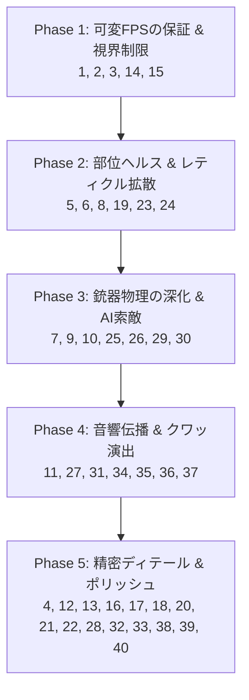

# 『エスケープ・フロム・ダッコフ (Escape from Duckov)』見下ろし型3D射撃特化 アプリケーション層 実装ロードマップ

## イントロダクション
本ドキュメントは、ゲームプロジェクト『Escape_from』を、リファレンス作品であるアヒル主人公の見下ろし型脱出シューター**『Escape from Duckov』**のように「3D空間でのシューティング体験、視界制限、銃器操作、アヒルの身体挙動、戦術的な音響とAI」に特化させ、商業クオリティ（大手企業品質）へ引き上げるためのアプリケーション層の実装ロードマップです。

本家（タルコフ）のリアルな銃器物理や部位ヘルスシステムのエッセンスを取り入れつつ、**見下ろし型（トップダウンビュー）の3Dシューティング体験**として最高のゲーム性・操作の手触り（Game Feel）を提供するための改善項目を優先順位順に**40個**に整理しました。

---

## 優先度定義
- **優先度：高 (High)**: 見下ろし型シューティングとしての移動・照準・射撃の根幹を可変FPS環境で保証するための必須機能。
- **優先度：中高 (Medium-High)**: 視線（視界）によるブラインド、レティクルのブレ制御、部位ダメージといった『Duckov』らしい緊迫感を生む機能。
- **優先度：中 (Medium)**: AIの索敵や回り込み、ドアの破壊、鳴き声（クワッ）によるデコイなど、戦術性を拡張するゲームプレイ機能。
- **優先度：中低 (Medium-Low)**: 被弾・死亡時のビジュアル演出や音響の回り込みなど、没入感を高めるポリッシュ（磨き込み）機能。
- **優先度：低 (Low)**: 跳弾物理やリザルト画面の3Dアヒルモデル表現など、さらにクオリティを細部まで突き詰めるための拡張機能。

---

## アプリケーション層 3D見下ろし型射撃特化 実装リスト（優先度順 40選）

### I. 基本ゲームループ＆可変フレームレート対応 (Core Loop & Framerate)

#### 1. 可変FPS下における移動・弾速・タイマーの整合性維持 (優先度: 高)
- **概要**: 描画負荷によってフレームレートが変動した際、アヒルの移動（よちよち歩き）速度や、弾丸の速度、脱出タイマーの減算速度が狂う現象を防止します。
- **アプローチ**: `deltaTime` を物理・タイマー計算に完全適用します。弾道の位置更新は、可変FPS下でも一定のシミュレーション間隔を維持するよう、サブステップ（固定時間幅での複数回ループ）で処理します。

#### 2. 多重脱出（Extraction）エリアと条件付き脱出制御 (優先度: 高)
- **概要**: 単一のリングに入るだけで脱出できる現状から、マップ内に複数の脱出地点を配置し、脱出範囲（TriggerVolume）に入ると「脱出カウントダウンUI」が開始されるようにします。
- **アプローチ**: 見下ろし型視点で見やすい円形のUIゾーンを描画し、脱出エリア内で一定時間静止することで脱出を完了させます。「バックパックなし限定」「鍵が必要」などの動的条件も判定します。

#### 3. レイド制限時間とMIA（時間切れロスト）判定ループ (優先度: 高)
- **概要**: 制限時間内に脱出ゲートへ到達できない場合、キャラクターがその場でロスト（死亡）扱いとなる脱出シューターの根幹システムです。
- **アプローチ**: `RaidTimer` サブシステムを構築します。残り時間を画面端に警告表示し、ゼロになった瞬間にプレイヤーを死亡（MIA）ステートへ移行させ、操作を無効化します。

#### 4. 一時停止（ポーズ）時の3D世界更新制御 (優先度: 高)
- **概要**: オンラインマルチプレイを模した脱出シューターでは、メニューを開いてもゲーム世界時間は止まりません。
- **アプローチ**: デバッグ用に一時停止を実装する場合でも、キャラクターの物理更新・AIの移動・出血などのスリップダメージ、およびカメラ制御をそれぞれ個別に停止/継続できる「更新フィルタリング」を構築します。

---

### II. リアリスティックな照準・射撃感覚（見下ろし型特化） (Top-down Gunplay & Reticle)

#### 5. マウスエイム時のレティクル拡散（スプレッド）と反動ブレ (優先度: 高)
- **概要**: FPSのような視界ブレ（カメラリコイル）の代わりに、射撃時に画面上の「照準器（レティクル）」が外側に拡大し、弾の散らばり（拡散度）が増大するシステムを実装します。
- **アプローチ**: `SpreadAngle` パラメータを導入します。連射するほどレティクルスプライトが拡大し、弾丸の射出方向を `正面ベクトル + ランダム拡散角度` で計算します。射撃を止めると Lerp で収束します。

#### 6. 移動速度と姿勢による射撃精度の動的ペナルティ (優先度: 高)
- **概要**: 移動（走り）ながら撃つと精度が最悪になり、立ち止まったり、姿勢を低くして狙うとレティクルの収束が極めて速くなるシステムです。
- **アプローチ**: 移動速度ベクトルとキャラクターの姿勢高さをパラメータ化し、これらを `SpreadAngle` の初期値や最大値、収束速度に動的に乗算します。

#### 7. 銃器のアタッチメントがスプレッドとエルゴノミクスに及ぼす影響 (優先度: 中高)
- **概要**: マズルブレーキ、フォアグリップ、スコープといったパーツの変更が、3D空間上の反動（レティクルの跳ね上がり）や、リロード速度に影響を与えます。
- **アプローチ**: 銃器クラスに `RecoilFactor`、`Ergonomics` などの基本パラメータを持たせ、装着されているアタッチメントの値を適用した合成値をレティクル拡散処理に反映します。

#### 8. マガジン残弾チェックアクション (優先度: 中高)
- **概要**: 画面上に常時残弾数が数値で表示されるカジュアルな仕様を廃止し、アクションをトリガーして確認させます。
- **アプローチ**: 残弾確認キーを押すと、アヒルが銃を取り出して重さを確認する短いアニメーションを再生します。画面端に「ほぼ満杯」「半分程度」「空に近い」とアバウトな残弾表現をテキストで表示します。

#### 9. タクティカルリロード vs スピードドロップリロード (優先度: 中)
- **概要**: リロードキー単押しで通常リロード（マガジンをインベントリに回収・遅い）、ダブルタップでスピードリロード（マガジンを床に捨てる・速い）を切り替えます。
- **アプローチ**: スピードリロード時は、マガジンを取り外した瞬間に「物理シミュレーションが有効な3Dマガジンオブジェクト」をアヒルの足元に放り投げ、これを後から拾い直せるようにします。

#### 10. 銃身長（バレル長）と壁の干渉回避（近接マズル干渉） (優先度: 中)
- **概要**: 銃身の長いライフルを持った状態で壁や障害物に近づきすぎると、銃口が壁に衝突し、キャラクターが銃を引き寄せて射撃できない状態になります。
- **アプローチ**: プレイヤーの正面方向に銃身の長さに応じた短いレイキャストを飛ばし、障害物との接触を検知した場合、銃の構えを「回避姿勢」に遷移させ、射撃をロックします。

#### 11. レーザーサイト/ライトの3D照射とAI探知 (優先度: 中)
- **概要**: 銃器に装着したタクティカルライトやレーザーサイトは、暗所で敵を視認しやすくしますが、光を当てられた敵AIがこちらの位置を即座に検知します。
- **アプローチ**: ライトのスポットコーン（コライダーまたは内積計算）を用いて、AIの視野センサー内に光源が入っているかを判定し、AIの警戒度を急上昇させるロジックを実装します。

#### 12. アヒルの特徴を活かした銃器反動自動補正（Wing Stability） (優先度: 中低)
- **概要**: キャラクターの「手羽の強さ」や「よちよち歩き時の安定度」といったアヒル特有のステータスが、連射時の反動抑制力に影響を与えます。
- **アプローチ**: パッシブスキルとして `WingStability` を定義し、連射時のレティクル最大拡散値をこのスキル値に応じて減衰させるロジックを実装します。

#### 13. 弾薬の個別装填（チューブマガジン・リロード） (優先度: 中低)
- **概要**: ショットガンのように弾を1発ずつ薬室に込めるリロード挙動と、ライフルなどのマガジン一括交換リロードの挙動を切り替えます。
- **アプローチ**: リロード処理中に「1発装填するごとにリロードアニメーションをループさせ、任意のタイミングで中断して射撃に移行できる」割り込み機能付きリロードシステムを構築します。

---

### III. 視線（Line of Sight）・暗闇・ライトシステム (FOV & Fog of War)

#### 14. 見下ろし型視界制限（Line of Sight / Fog of War）システム (優先度: 高)
- **概要**: 見下ろし型視点でありながら、プレイヤーの視界の外（壁の裏、死角）にいる敵やアイテムは、画面上に描画されず非表示になります。
- **アプローチ**: プレイヤー位置を起点とする2次元のレイキャストまたはシャドウマップによる視野制限マスクを描画し、視線が通らない場所を黒い影（Fog of War）で覆います。影の中にいる敵アセットの `Draw` 処理をスキップします。

#### 15. タクティカルライトによる「暗闇の照らし出し」と3Dシャドウ生成 (優先度: 高)
- **概要**: 夜間や暗い屋内マップにおいて、ライトの光の円錐（コーン）が当たる範囲だけが視界として露出し、壁の影がリアルタイムに変形します。
- **アプローチ**: プレイヤーの向いている方向にスポットライト（Spotlight）を配置し、障害物の影（D3D12シャドウマップ）を計算して、光が当たっている部分のみの視界マスクを拡張します。

#### 16. 暗視装置（NVG）とサーマルスコープの見下ろしポストプロセス (優先度: 中)
- **概要**: 暗闇を緑色に強調する暗視モードや、生物の熱源（熱を持ったアヒルやScav）を白くハイライトする熱源視覚を再現します。
- **アプローチ**: 暗視装置ON時は画面全体に緑色のトーンマッピングと粒子ノイズ（グラニュラーノイズ）を重ねます。サーマル時はシーンをモノクロにし、アヒルや敵キャラクターのモデルのレンダリングマテリアルを自己発光（Emissive）させて白く浮き上がらせます。

---

### IV. 3D弾道物理＆被弾レスポンス (Ballistics & Hit Response)

#### 17. 3D弾道落下（物体の高さ）と障害物の遮蔽・貫通判定 (優先度: 高)
- **概要**: 見下ろし型であっても、弾丸は「高さ（Y座標）」を持っており、机の上の障害物を飛び越えたり、薄い木の壁を貫通してダメージを与えたりします。
- **アプローチ**: 3Dの放物線レイキャストを用いて弾道軌道を追跡し、障害物と衝突した際にその「貫通抵抗値」と弾の「貫通値」を比較します。貫通した場合は、弾速とダメージが低下した状態で弾丸が直進します。

#### 18. 防弾衣類の部位別コライダー（アヒルアーマー） (優先度: 高)
- **概要**: アヒルの頭部、手羽、胴体、脚といった当たり判定コライダーを個別に定義し、装備している防具がカバーする面積に応じてダメージを計算します。
- **アプローチ**: キャラクターのボーン階層に「ヘルメットコライダー」「ベストコライダー」をアタッチします。コライダーごとに防弾性能と耐久度を設定し、防具の隙間に当たった場合は直接大ダメージを与えます。

#### 19. 被弾時のエイムパンチ（レティクルの強制ブレ）とひるみ (優先度: 高)
- **概要**: 敵の銃弾を浴びた瞬間、アヒルがひるみ（スタン）、持っていた銃のレティクルが強制的に最大まで広がって一時的に精密射撃が不可能になります。
- **アプローチ**: 被弾イベントの発生時、`SpreadAngle` を強制的に最大値の数％〜数十％増加させ、さらにマウス入力座標を微小に強制スクロールさせることで、エイムのブレ（エイムパンチ）を表現します。

#### 20. 跳弾（リコシェ）物理と二次被害判定 (優先度: 中低)
- **概要**: 弾丸が金属製の壁やヘルメットに浅い角度で命中した際、弾が跳ね返り、3D空間上の別のオブジェクトにヒットします。
- **アプローチ**: 弾丸と壁コライダーの衝突点における法線ベクトルから反射角を計算し、弾速を減衰させて反射方向に新たな弾道を伸ばします。

#### 21. ダメージ数値の3Dポップアップと羽毛（フェザー）エフェクト (優先度: 中低)
- **概要**: 敵に弾が当たった際、ダメージ数値が3D空間上で跳ね上がるようにポップアップし、アヒルの羽毛が飛び散ることで爽快感を高めます。
- **アプローチ**: ダメージ発生時、被弾点の3D座標から上方向へイージングをかけて動くテキストスプライトを生成します。同時に、白いアヒルの羽毛パーティクルを周囲にスプレー状に射出します。

#### 22. 被弾方向インジケーター（3Dダメージアーク） (優先度: 中低)
- **概要**: 画面外や死角から撃たれた際、アヒルの中心からダメージを受けた方向に向かって赤い半円形のインジケーターを表示します。
- **アプローチ**: プレイヤーの座標と発砲した敵の座標から角度を算出し、UI上のプレイヤーアイコンの周りにその角度に応じた方向指示マークを数秒かけてフェードアウト表示します。

---

### V. 部位別ヘルス＆アヒルの身体挙動 (Bodily Health & Duck Stances)

#### 23. 7部位の個別HP（頭・胸・腹・手羽・両脚）と部位破壊 (優先度: 高)
- **概要**: アヒルの身体部位ごとにHPを管理し、0（破壊/壊死）になった部位に応じたペナルティを課します。
- **アプローチ**:
  - **頭部/胸部破壊**: 即死亡（KIA）。
  - **脚部の破壊**: 移動（よちよち歩き）が極端に遅くなり、ダッシュ不可。
  - **手羽（腕）の破壊**: 銃の照準ブレが激増し、エイムスタミナ消費が数倍に。

#### 24. 手羽・脚破壊時のダメージ全身伝搬（分配）システム (優先度: 高)
- **概要**: すでにHPが0（壊死）になった部位にさらなる被弾があった場合、そのダメージを生存している他の健康な部位に分配して減算します。
- **アプローチ**: 壊死部位への被弾時、`Damage * 伝搬係数` を計算し、生存している他の部位の残りHPから均等に差し引きます。これにより、脚ばかりを撃ち続けられても死亡するメカニクスを再現します。

#### 25. 二重スタミナ（よちよちスタミナ・手羽スタミナ）管理 (優先度: 中高)
- **概要**: 走る・歩くための「脚スタミナ」と、銃を構える（ADS）ための「手羽スタミナ」を分離します。
- **アプローチ**: `WaddleStamina` と `WingStamina` を独立して更新します。手羽スタミナが尽きると、銃をしっかりと構えることができず、レティクルの拡散が戻らなくなります。

#### 26. 出血による血痕（ブラッドトレイル）の3D空間配置 (優先度: 中高)
- **概要**: 出血状態のキャラクターが移動した際、その真下の地面に血痕が滴り落ち、それを追跡できるようになります。
- **アプローチ**: 出血ステート時にタイマーまたは移動距離を計測し、足元から真下へレイキャストを飛ばして接地したポリゴンに対し、デカール（血痕スプライト）を動的生成して貼り付けます。

#### 27. 状態異常（骨折・出血・空腹）と治療（よちよち処置） (優先度: 中)
- **概要**: 被弾やトラップによって発生した負傷を、戦術キットや副木（スプリント）を用いて治療します。
- **アプローチ**: 治療アイテム使用中、移動速度を極限まで下げ、射撃をロックします。アヒルが包帯を巻くSEを再生し、完了後に部位HPを回復または状態異常を解除します。

#### 28. 所持重量システムによる移動慣性と旋回ディレイ (優先度: 中)
- **概要**: 3D空間でアイテムを拾いすぎて総重量（Weight）が増えると、移動の「歩き出し」と「急停止」に大きな慣性が生じ、旋回性能が低下します。
- **アプローチ**: アヒルの最高速度とダッシュ加速度に対し、所持重量に応じた減衰パラメータを掛け合わせます。重い時はダッシュ後に止まろうとしても数歩滑る挙動を物理演算に加算します。

---

### VI. 見下ろし型戦術AIとスポーン制御 (Top-down Tactical AI)

#### 29. AI（Scav鴨）の視覚（コーン判定）と聴覚（音響検出） (優先度: 中高)
- **概要**: 敵AIが壁の裏側や視覚外のプレイヤーを不自然に感知するのを防ぎ、リアルな視界・聴覚センサーを構築します。
- **アプローチ**: AIの正面に視覚用コーンを設定します。プレイヤーが視認範囲に入るか、走る・射撃するなどの「音ノイズ（発音半径）」を発生させた場合にのみ、AIがその位置に警戒・移動するように設計します。

#### 30. AIの警戒段階（パトロール・探索・戦闘・フランク） (優先度: 中高)
- **概要**: AIの行動パターンを単純な射撃だけでなく、「警戒状態」に基づいて変化させます。
- **アプローチ**: 有限ステートマシン（FSM）を構築します。不審な音を聞くと `Search`（銃を構えて音源をゆっくり捜索）に移行し、戦闘中はプレイヤーの退路を断つように回り込み（Flanking）行動をとるアルゴリズムを記述します。

#### 31. AIの遮蔽物利用（カバー＆ムーブ）ノードシステム (優先度: 中高)
- **概要**: AIはプレイヤーに見つかると、最も近い岩や壁の裏に走り込み、遮蔽物から体を乗り出して射撃します。
- **アプローチ**: マップの3D空間上に `CoverPoint` ノードを配置し、プレイヤーからの射線（Ray）が通らないポイントを動的に選択してAIを移動させます。

#### 32. AIの射撃方法選択（バースト射撃・制圧射撃） (優先度: 中)
- **概要**: AIが常に一定間隔で撃つのではなく、プレイヤーとの距離や使用武器に応じて単発、バースト（3点バースト）、フルオートを切り替えます。
- **アプローチ**: AIの射撃制御スクリプトを拡張し、中距離では「指切りバースト」、遠距離では「精密単発」、プレイヤーが遮蔽に隠れた後は「角に向けた制圧射撃（プレファイア）」を行うロジックを追加します。

#### 33. 見下ろし型における敵の不意打ちスポーン防止（視界除外） (優先度: 中)
- **概要**: プレイヤーの画面内（視界内）に敵が突如ワープして出現するような不自然なスポーンを防ぎます。
- **アプローチ**: 敵をスポーンさせる座標が、プレイヤーのカメラの描画範囲（ビューポータル）の外であること、かつ最小距離（例: 30m）以上離れていることを検証してから生成します。

---

### VII. 没入感を高める音響・UI・エフェクト演出 (Audio, UI & VFX Polish)

#### 34. 3D音響オクルージョン（壁・ドア）を考慮した音響減衰 (優先度: 中高)
- **概要**: 壁の向こう側の足音や銃声はこもって聞こえ（ローパス）、ドアが開くとクリアに聞こえるなど、遮蔽物の材質と厚みに応じてリアルタイムに音質を変化させます。
- **アプローチ**: 音源とカメラ（リスナー）の間にレイをキャストし、遮蔽物（コンクリート、木、ガラス）を検出します。遮蔽されている場合は、音声をローパスフィルター（LPF）に通し、こもらせます。

#### 35. 屋内・屋外の環境残響効果（インパルス応答） (優先度: 中高)
- **概要**: 狭いコンクリートの部屋で撃った音（激しく反響する）と、屋外の広い草原で撃った音（乾いた音が遠くに抜ける）で、銃声や足音の残響を変化させます。
- **アプローチ**: プレイヤーの周囲に巨大なインビジブルコライダー（Reverb Volume）を設定するか、定期的に複数のレイを飛ばして周囲の壁までの距離（閉鎖空間度）を測定し、リバーブエフェクト（D3D12/XAudio2のリバーブサブミックス）のパラメータを動的に変更します。

#### 36. 地面材質連動型の足音・水しぶきシステム (優先度: 中低)
- **概要**: アスファルト、草地、砂利、木製の床、鉄板、または水溜まりを歩く際、足音のSEとスプラッシュ（水しぶき）のエフェクトを動的に切り替えます。
- **アプローチ**: キャラクターの足元から下方向へレイキャストを行い、衝突した地形ポリゴンに設定されているマテリアルIDを取得します。マテリアルIDに対応した音とエフェクトを発生させます。

#### 37. アヒルの「鳴き声（Quack / クワッ）」の戦略的利用とAI誘導 (優先度: 中低)
- **概要**: プレイヤーが意図的に「クワッ」と鳴く（Quackキー）ことで、周囲の敵AIの注意を引きつけ、その方向に誘い込む（デコイ効果）ことができます。
- **アプローチ**: クワッキー入力時に、プレイヤーの位置から特定の半径で「音響ノイズイベント」を発生させます。範囲内のAIはプレイヤーの元の位置ではなく、「鳴き声が発生した座標」を目標（Last Known Sound Position）として捜索を開始します。

#### 38. 死亡時の耳鳴り（Tinnitus）と無音化フェード (優先度: 中低)
- **概要**: アヒルが死亡した瞬間、ゲーム内の全ての音がミュートされ、キーンという耳鳴りだけが響く演出です。
- **アプローチ**: 死亡トリガー時、メインのオーディオチャンネルの音量を瞬間的にゼロにし、単一の高音サイン波（耳鳴りSE）を再生しながら、3D画面を黒くフェードアウト（暗転）させます。

#### 39. 扉の3Dインタラクション（ドア蹴り破り・エントリー） (優先度: 中低)
- **概要**: ドアを単に開閉するだけでなく、鍵を使って開ける、少しだけ開けて覗く、勢いよく蹴り破る（Breach）といったアクションです。
- **アプローチ**: ドアオブジェクトに複数のステート（Closed, Open, Ajar, Locked, Breached）を定義します。蹴り破った際はドアが物理的な勢いで開き、近くにいる敵キャラクターにノックバックとスタンを与えます。

#### 40. リザルト画面での被弾・弾着部位の3Dアヒルモデルマッピング (優先度: 低)
- **概要**: レイド終了時に、プレイヤーの「どの部位にどの弾が当たったか」を3Dアヒルモデルを用いて視覚的に確認できる機能です。
- **アプローチ**: 被弾イベント発生時に、アヒルモデルのどの部位コライダー（ボーン）に衝突したかをログに記録しておき、リザルト画面の3Dアヒルモデル上の対応するポリゴンに赤色の弾痕マークを描画します。

---

## 推奨される段階的導入ステップ

見下ろし型3D脱出シューター『エスケープ・フロム・ダッコフ』の仕様を具現化するため、以下のステップで既存の `Escape_from` ブランチを拡張していくことを推奨します。

---
**作成日**: 2026年6月15日
**対応ブランチ**: `Escape_from` 最新 (6月14日更新分準拠)
**設計思想**: レイド外の倉庫・ハイドアウト管理ではなく、見下ろし型3D空間におけるリアルな射撃手触りと、視界制限（Fog of War）によるスリリングな戦闘の追求
