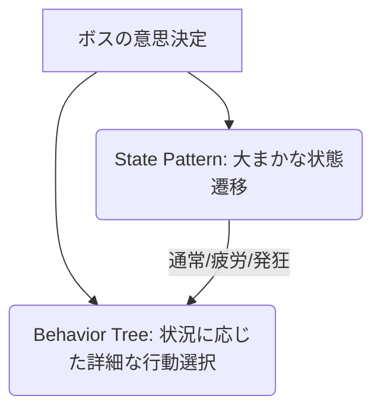
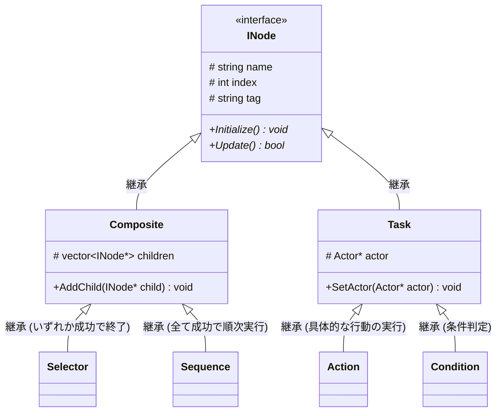

# 実績紹介: ボスの行動制御 (AI & Behavior Tree)

本稿では、自作ゲームエンジンにおいて実装した**ボスの行動制御AI（Behavior Tree & State Pattern）**の設計と実装について解説します。

---

## 🛠️ プロジェクト概要

「機械的に動く敵ではなく、**そのキャラクターを一人の人・生物と対峙しているような感覚**を味わってもらい、ゲームに没入してもらう」ことを最終目標に、自然な行動選択を行うAIを作成しました。



---

## 🌟 こだわりと苦労したポイント

| 項目 | 内容 |
| :--- | :--- |
| **この項目でのこだわり** | <ul><li>Behavior Treeによる行動制御により、完全に機械的な動きを排除し、プレイヤーとの距離や状態に応じたランダム性・状況判断を両立できた点。</li><li>設計にあたりオブジェクト指向の原則を徹底し、ポリモーフィズム（多態性）や継承の仕組みを深く理解・実践できた点。</li></ul> |
| **苦労したポイントと解決策** | <ul><li>**ノードエディタの作成**: `ImNodes`（ImGuiの拡張）を用いたエディタ作成において、ノード間のLink（接続）処理の実装に非常に手こずりました。</li><li>**行動と条件関数の紐づけ**: `Actor`クラスの実装および`std::map`を活用した関数ポインタの管理手法を導入することで、動的な紐づけをスマートに解決しました。</li></ul> |

---

## 🧠 行動制御のコアアルゴリズム

自然な意思決定を実現するため、以下の2つのパターンを組み合わせて実装しています。

### 1. Behavior Tree（ビヘイビアツリー）
各ノードで構築した木構造を巡回し、状況に応じた適切な行動を選択するアルゴリズムです。プレイヤーとの距離や自身の残りHPなどを判別し、条件に合致した行動を自律的に選択します。

### 2. State Pattern（ステートパターン）
キャラクターの「通常状態」「疲労状態」「発狂モード」といった大まかな状態（ステート）を管理します。それぞれのステートに対して異なる Behavior Tree を割り当てることで、状態に応じた変化に富むAIの挙動を実現しています。

---

## 📐 クラス設計

設計にあたっては、以下の3点に重点を置きました。
1. **汎用性はあるか**（他のエネミーやオブジェクトにも流用できるか）
2. **エディタで操作しやすいか**（視覚的にノードを構築できるか）
3. **時間をかけすぎないこと**（シンプルかつ堅牢な実装）

### クラス階層図 (Mermaid)



### 各ノードの役割

*   **SequenceNode（シーケンスノード）**
    *   自身の子ノードを左から順番に実行し、**すべて成功（true）**したら `true` を返します。途中で一つでも失敗すると即座に `false` を返します（例: 「近づく」→「攻撃する」の一連の動作）。
*   **SelectorNode（セレクターノード）**
    *   自身の子ノードを順番に実行し、**一つでも成功（true）**したらその時点で `true` を返します。すべて失敗した場合のみ `false` を返します（例: 「HPが低いか判定」し、Yesなら「回復」、Noなら「次の選択肢へ」）。
*   **ActionNode（アクションノード）**
    *   自身に設定された具体的な行動（移動、攻撃など）を実行する末端（リーフ）ノードです。
*   **ConditionNode（コンディションノード / 条件分岐ノード）**
    *   設定された条件分岐（プレイヤーとの距離、残りHPなど）を実行し、その成否を返すノードです。

---

## 💻 コード解説

### 1. `INode` (インターフェース / 基底クラス)

すべてのノードの共通の親クラスとなる抽象クラスです。ノードの名前、インデックス（ノードエディタ管理用）、タグ（振る舞いの識別用）を持ちます。

```cpp
#pragma once
#include <string>

class INode {
protected:
    std::string name;  // ノード名 (例: "Sequence", "AttackAction")
    int index;         // ノード番号 (ImNodesでのノード管理・接続管理用)
    std::string tag;   // ノードの役割を示すタグ (例: "Behavior", "Condition")

public:
    INode() : index(-1) {}
    virtual ~INode() = default;

    // 初期化処理。派生クラスで実装する
    virtual void Initialize() = 0;

    // 毎フレームの実行処理。派生クラスで具体的な挙動を定義し、実行結果をboolで返す
    virtual bool Update() = 0;

    // ゲッター・セッター
    int GetIndex() const { return index; }
    void SetIndex(int idx) { index = idx; }

    const std::string& GetName() const { return name; }
    void SetName(const std::string& n) { name = n; }

    const std::string& GetTag() const { return tag; }
    void SetTag(const std::string& t) { tag = t; }
};
```

> [!NOTE]
> **実行結果を判定する戻り値の工夫**
> `Update` が返す `bool` 値によって、一度実行した条件判定を繰り返し毎フレーム評価し直さないように制御しています。これにより、無駄な処理コストを削減し、意図しない挙動のブレを防いでいます。

---

### 2. `Task` (末端アクション / 条件ノードの基底クラス)

`Action` や `Condition` などの子ノードを持たないリーフノード用クラスです。対象となる `Actor` (プレイヤーや敵キャラクターの基底クラス) へのポインタを保持し、Actor側のパラメータや関数を参照して行動・判定を行います。

```cpp
#pragma once
#include "INode.h"

// 前方宣言
class Actor;

class Task : public INode {
protected:
    Actor* actor = nullptr; // 制御対象のキャラクターへのポインタ

public:
    Task() = default;
    virtual ~Task() = default;

    // Actorの設定 (ノードエディタ等から動的に紐づける)
    void SetActor(Actor* act) { actor = act; }

    // Taskノードは構造上、子ノードを持たないため、
    // 誤って子ノードを追加しようとした場合は何も処理しない、あるいはアサートで防ぎます
    void AddChild(INode* child) {
        // 子ノードを持たせない設計のため、実質空の関数にする (引数を利用しない)
    }
};
```

> [!IMPORTANT]
> **Actorポインタの役割**
> ノードエディタ上で選択された特定の `Actor` からデータを取得したり、行動を指定したり、条件判定に利用します。これにより、Behavior Tree のロジック部分と、ゲーム内のキャラクター実体の定義を完全に分離でき、再利用性が高まります。

---

### 💡 苦労したポイントの深掘り：std::mapによる「行動と条件関数」の紐づけ

アクションノードや条件ノードが、対象の `Actor` に対して「どの関数を呼べばいいか」を動的に解決するため、`std::map` と**メンバー関数ポインタ**を利用したイベントバインディングを実装しました。

これにより、ノードの追加や変更時に毎回ハードコーディングすることなく、エディタ上で設定した文字列キーに基づいて `Actor` の関数を呼び出すことができます。

```cpp
// Actor側での登録・呼び出しのイメージ
#include <unordered_map>
#include <string>
#include <functional>

class Actor {
private:
    // 行動関数の登録テーブル
    std::unordered_map<std::string, std::function<bool()>> actionMap;

public:
    void RegisterActions() {
        // 行動や判定関数を登録
        actionMap["Attack"] = [this]() { return this->ExecuteAttack(); };
        actionMap["MoveToPlayer"] = [this]() { return this->ExecuteMoveToPlayer(); };
        actionMap["IsPlayerNear"] = [this]() { return this->CheckPlayerNear(); };
    }

    bool TriggerAction(const std::string& actionName) {
        if (actionMap.find(actionName) != actionMap.end()) {
            return actionMap[actionName](); // 登録された関数を実行
        }
        return false;
    }

    // 各アクションの具体的な挙動
    bool ExecuteAttack() { /* 攻撃処理 */ return true; }
    bool ExecuteMoveToPlayer() { /* 移動処理 */ return true; }
    bool CheckPlayerNear() { /* 距離判定 */ return true; }
};
```

> [!TIP]
> この設計により、Behavior Tree の `ActionNode` は、メンバ変数 `tag`（例: `"Attack"`）をキーにして `actor->TriggerAction(tag)` を呼ぶだけでよくなり、非常に疎結合で拡張しやすい設計になりました。
