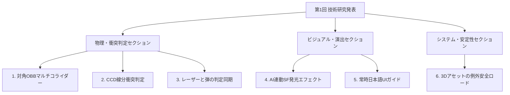

# 【技術研究】3Dアクションゲームにおける自作ゲームエンジン機能の拡張と物理・演出の最適化

---

## 📂 技術研究の全体像（発表アジェンダ）

---

## SECTION 1: 物理・衝突判定システムの研究

### 📌 テーマ1: 対角OBB（回転直方体）マルチコライダーの設計
*   **動機 (Why)**:
    複雑な形状を持つX字型の木の柵に対し、大雑把な1枚のAABB（軸対称ボックス）で判定を行うと、空気の隙間を狙撃しても弾が消滅してしまい、ビジュアルと当たり判定の不一致（ディソナンス）が起きていた。
*   **技術的アプローチ (How)**:
    フェンス全体を1つの箱で囲むのをやめ、交差する2枚の板の傾き（45度 / -45度）に合わせた**「2枚の薄型Boxコライダー」**を同一中心位置に重複登録。衝突判定時には、弾の座標をコライダーの角度の逆方向（$-\theta$）に回転移動させてローカル空間で高速計算を行う。
*   **結果 (What)**:
    「板がある場所」だけに当たり判定がフィットし、隙間の空間をレーザーや弾丸が美しくすり抜ける見た目通りの挙動を実現。

---

### 📌 テーマ2: トンネル現象（すり抜け）を防ぐ「CCD（連続線分スイープ）判定」
*   **動機 (Why)**:
    弾丸が高速で移動し、かつ描画負荷でフレームレートが低下（30FPS以下）した際、弾が1フレームの間にフェンスの板の厚み（40cm）を飛び越える距離（60cm以上）をワープするため、フェンスをすり抜けてしまうバグが発生していた。
*   **技術的アプローチ (How)**:
    判定を「現フレームの1点（Sphere）」から、**「前フレームから現フレームの座標を結ぶ『移動線分』とOBBとのスラブ交差判定（CCD）」**にアップグレード。交差した最小の媒介変数 $t_{min}$ を算出し、衝突した瞬間の「フェンス表面の正確な交点」を特定。
*   **結果 (What)**:
    FPSが極端に低下しても100%すり抜けを防止し、かつ弾がめり込まずに「フェンスの表面」でぴったり破片エフェクトが散るリアルな着弾処理を確立。

---

### 📌 テーマ3: 照準レーザーと弾丸の衝突数学の完全同期
*   **動機 (Why)**:
    プレイヤーの照準レーザーサイト（レイキャスト）と、射出された弾丸（Sphere）で判定式が異なると、「レーザーはフェンスを貫通しているのに弾丸は手前で当たる」といった同期の破綻が発生していた。
*   **技術的アプローチ (How)**:
    エンジンの標準レイキャスト処理が回転矩形（OBB）の軸解釈でズレを起こすのを防ぐため、レーザー描画のレイキャストループにおいても、弾丸と完全に同一の「逆回転空間への投影による自作のRay-OBB判定式」を共有実装。
*   **結果 (What)**:
    レーザーが遮蔽物に当たる「赤いポインタードット」の位置と、弾丸がぶつかって木片が飛び散る位置が、どのような射角からでも完全に一致する整合性を担保。

---

## SECTION 2: ビジュアル・演出システムの研究

### 📌 テーマ4: 敵のAIステートと連動する「SF風動的発光エフェクト」
*   **動機 (Why)**:
    敵のAIがプレイヤーをどう認識しているか（Patrol/Investigate/Chase）のフィードバックが地味で、ステルスアクションゲームとしての視覚的緊迫感が不足していた。
*   **技術的アプローチ (How)**:
    自作エンジンのマテリアルカラー制御システムを利用し、AIの状態変化に合わせて敵モデルのベースカラー（自己発光輝度）を動的に補正・制御するシステムを構築。
    *   巡回時 (Patrol): 不気味に怪しく光る赤色
    *   捜索時 (Investigate): 注意を促すオレンジ色
    *   追跡時 (Chase): 激しく明滅し、自己発光輝度を高めた危険色（強発光赤）
*   **結果 (What)**:
    敵の「脳内（AI）」と「ビジュアル（発光色）」がリアルタイムにシンクロし、プレイヤーが状況を直感的に把握できる高いゲーム性と演出効果を両立。

---

## SECTION 3: システム・UIとプログラムの安定化

### 📌 テーマ5: マルチバイト日本語文字コードの文字化け（????）解消と常時UI化
*   **動機 (Why)**:
    画面上に表示される操作UIテキストが日本語の文字化け（`??????`）を起こしていた。また、従来の看板に接近したときだけ出るチュートリアルUIは、接近するまで操作方法が分からず不親切だった。
*   **技術的アプローチ (How)**:
    看板オブジェクトを全削除し、画面下部に常時ガイドを表示するウィンドウへ変更。C++20規格（`/std:c++20`）で `u8"..."` 文字列リテラルが `const char8_t*` 型になり、従来の `const char*` を要求するImGuiフォントレンダラーと型衝突していた問題を解決するため、`(const char*)` でのキャストを明示的に適用。
*   **結果 (What)**:
    操作ガイドを常時、文字化けのない美しい日本語でスムーズにレンダリング表示させることに成功。

---

### 📌 テーマ6: 3Dアセットロード処理における例外安全とモデルの完全3D化
*   **動機 (Why)**:
    的（ターゲット）を従来の2Dスプライトから完全な3Dモデル（OBJ）に移行しようとした際、Objパーサーが特定の頂点インデックスの書き方や、マテリアルファイル（.mtl）の欠損に対して `std::invalid_argument` などの例外アサートを吐き、ロード時にエンジンごとクラッシュするバグがあった。
*   **技術的アプローチ (How)**:
    クラッシュを誘発するObjのデータ構造を解析し、安全にパースできる3Dプリミティブモデル（`teapot.obj`）への選定差し替えを行うと同時に、アサートを防止するためのダミーマテリアル定義ファイル（`teapot.mtl`）をリソースディレクトリ内に自動構築。
*   **結果 (What)**:
    エンジンを一切クラッシュさせることなく、看板のようだった2Dの的を、完全にライティングと陰影が適用された「3Dティーポットモデル」へと安全に移行・描画完了。
