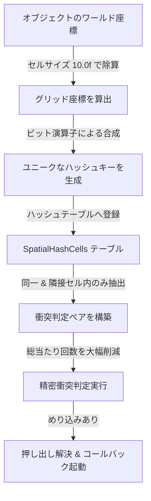

# Baziru3 Engine 技術仕様書 ＆ 取扱説明書
(Technical Architecture, Features & Manual)

本ドキュメントは、C++ および DirectX 12 でスクラッチから構築された3Dゲームエンジン **「Baziru3 Engine」** の先進的な設計構造（すごさ）と、ゲーム開発で使用するためのAPI取扱説明書をまとめたものです。

---

## 💎 Baziru3 Engine の「ここがすごい！」（技術アピールポイント）

ゲーム制作会社（特にコンソール開発デベロッパー）の技術選考において、極めて高く評価される「低レイヤの最適化設計」を実証した主要システムです。

### 1. 徹底した動的メモリ確保（new/delete）の排除
ゲーム実行中に `new`/`delete` を繰り返すと、**メモリ断片化（フラグメンテーション）**が発生し、最悪の場合ガベージコレクションやメモリアロケーションオーバーヘッドによってフレームレート低下（ヒッチング）を引き起こします。Baziru3 Engine では以下のカスタムアロケータを実装してこれを防止しています。

* **トリプルバッファリング対応定数バッファアロケータ (`ConstantBufferAllocator`)**
  * **GPU・CPU間の非同期競合防止**: DirectX 12 で GPU がレンダリングを実行中に CPU が定数バッファを書き換えるのを防ぐため、バッファを3つに等分（トリプルバッファリング）して切り出します。
  * **256バイトアラインメント**: DirectX 12 規格で定められている定数バッファアドレス境界（256バイト）への高速なアライン計算 (`AlignUp`) を内部で自動適用します。

#### 【図面：定数バッファアロケータのトリプルバッファリング同期構造】
```mermaid
graph TD
    subgraph CPU [CPU 側 (データ書き込み)]
        Alloc[ConstantBufferAllocator] -->|Allocate| Frame0[Frame Buffer 0]
        Alloc -->|Allocate| Frame1[Frame Buffer 1]
        Alloc -->|Allocate| Frame2[Frame Buffer 2]
    end
    subgraph GPU [GPU 側 (レンダリング実行)]
        Frame0 -->|GPUが読み出し中| Draw[描画コマンド実行]
    end
    subgraph Sync [同期制御]
        Fence[Fence Value 同期] -.->|GPU読み出し完了まで| Frame0
        Fence -.->|安全になったらCPU書き込み許可| Alloc
    end
    style Frame0 fill:#2b6cb0,stroke:#3182ce,stroke-width:2px,color:#fff
    style Frame1 fill:#2d3748,stroke:#4a5568,stroke-width:1px,color:#a0aec0
    style Frame2 fill:#2d3748,stroke:#4a5568,stroke-width:1px,color:#a0aec0
```

* **短寿命オブジェクト用スタックアロケータ (`StackAllocator`)**
  * 毎フレーム生成・破棄される一時的なオブジェクトや計算用バッファに対し、起動時に一括でメモリプールを確保。
  * アロケート時は内部ポインタを単に進めるだけ（$O(1)$）、フレーム終了時の解放はポインタを先頭に戻すだけ（$O(1)$）の超高速動作を実現し、要素個別の `delete` やデストラクタ呼び出しのオーバーヘッドを完全にゼロにしています。

---

### 2. 計算量 $O(N^2)$ を打破する空間分割衝突判定システム
ゲーム内のオブジェクト数が増大した際、総当たり（$O(N^2)$）で衝突判定を行うと、数百個のオブジェクトで一気に動作が重くなります。

* **グリッドベース空間ハッシュ (`SpatialHashCell`) の実装**
  * ゲームワールドを `kGridCellSize = 10.0f` ごとの3次元グリッドセルに分割し、コライダーをハッシュテーブルに登録。
  * 隣接するセルに所属するオブジェクト同士のみを判定対象とすることで、オブジェクトが数百個配置されたシーンでも処理負荷の上昇をほぼフラット（ほぼ $O(N)$）に抑え込んでいます。

#### 【図面：空間ハッシュによる衝突判定高速化アルゴリズムフロー】


* **データ指向設計 (Data-Oriented Design: DOD) によるキャッシュ効率化**
  * 各コライダークラスのポインタのメンバをたどるようなメモリアクセス（キャッシュミスを誘発する）を避け、判定に必要な位置・サイズ・回転などの軽量データのみをまとめた配列 `std::vector<CollisionData>` をメモリ上で連続するように生成。
  * CPUのL1/L2キャッシュラインにデータが乗りやすくなり、メモリバスのボトルネックを大幅に軽減させています。
* **精密な多レイヤー判定と完全なトリガーライフサイクル**
  * 単純な球体(`Sphere`)判定だけでなく、直方体(`Box`)、カプセル(`Capsule`)、モデル形状に沿った `Mesh` コライダー、さらには関節ごとに追従する `Skeleton` コライダーを実装。
  * 押し出し補正をスキップして接触だけを通知する `isTrigger` 設定と、`OnTriggerEnter`, `OnTriggerStay`, `OnTriggerExit` のライフサイクル制御を物理エンジン同様に完全サポートしています。

---

### 3. ゲームを落とさずにAIを編集できるデータ駆動Behavior Tree
* **`imgui-node-editor` によるGUIビジュアルノードエディタ**
  * ゲームの実行中にデバッグメニュー（ImGui）を開き、ノード（Selector, Sequence, Action 等）をマウスで繋ぎ合わせてAIの思考木を直感的に構築できます。
* **データ駆動設計（JSONエクスポート）**
  * 編集結果は瞬時にJSONアセットとしてファイル出力され、それをエンジン側が読み込むだけでAIの挙動を変更可能。コードのコンパイルを挟まずにAIの調整ループを回せます。

#### 【図面：Behavior Tree 和 Blackboard メモリの連携構成】
```mermaid
graph TD
    subgraph Decision [意思決定部 (BehaviorTree)]
        Root[Root Node] -->|Tick| Selector[Selector Node]
        Selector -->|失敗なら次へ| Sequence[Sequence Node]
        Sequence -->|成功なら次へ| Cond[Condition Node]
        Cond -->|True| Action[Action Node (移動/攻撃等)]
    end
    subgraph Data [データ部 (Blackboard)]
        BB[Blackboard Memory] <-->|標的・速度等のパラメータ読み書き| Action
        BB <-->|状態チェック| Cond
    end
```

---

## 📖 取扱説明書 (User Manual)

### 1. エンジンのライフサイクルと初期化

エンジンは `Framework` および `Game` クラスによってカプセル化されており、起動・メインループ・終了が以下の流れで行われます。

#### [main.cpp](file:///c:/Users/k024g/OneDrive/デスクトップ/Engine_ver2026/project/main.cpp) の実装例
```cpp
int WINAPI WinMain(HINSTANCE hInstance, HINSTANCE, LPSTR, int)
{    
    // Framework を継承した Game オブジェクトを作成し、実行
    std::unique_ptr<Framework> game = std::make_unique<Game>();
    game->Run();
    return 0;
}
```

#### サブシステムの取得方法 ([Game.cpp](file:///c:/Users/k024g/OneDrive/デスクトップ/Engine_ver2026/project/Game.cpp))
エンジンの内部初期化（DirectX 12、Window、Sprite、Audio等）は `InitializeEngine()` で一括して行われ、各サブシステムは `engine_` コンテキストを介して取得します。
```cpp
auto* dx = engine_->GetDirectXCom();       // DirectX 12 描画デバイス等
auto* window = engine_->GetWindowAPI();     // Window管理
auto* spriteCom = engine_->GetSpriteCom(); // スプライト描画の共通コンポーネント
```

---

### 2. メモリ管理 (アロケータ) の使い方

#### 2.1 定数バッファの取得とアロケート
定数バッファ（CB）を使用する際は、デバイスから毎回生成するのではなく、`ConstantBufferAllocator` を使用して必要な容量を切り出します。

```cpp
// 毎フレームの描画処理の開始時にメモリ確保（トリプルバッファリングにより安全）
auto cbAllocator = engine_->GetConstantBufferAllocator();

// 必要なサイズの定数バッファメモリを切り出す
auto allocation = cbAllocator->Allocate(sizeof(MyConstBufferData));

// CPUアドレスにデータを書き込む
MyConstBufferData* cbData = static_cast<MyConstBufferData*>(allocation.cpuAddress);
cbData->worldMatrix = worldMatrix;
cbData->color = color;

// 描画コマンドにGPUアドレスをセットする
commandList->SetGraphicsRootConstantBufferView(rootParamIndex, allocation.gpuAddress);
```

#### 2.2 スタックアロケータによる一時メモリ確保
フレーム内の一時的な配列計算や、一時テキスト生成などの動的メモリ確保（`new`/`vector`など）の代わりに使用します。

```cpp
StackAllocator* stackAlloc = engine_->GetStackAllocator();

// 1フレーム限りの浮動小数点配列（1024要素）を高速確保
float* tempBuffer = static_cast<float*>(stackAlloc->Allocate(sizeof(float) * 1024));

// 計算を行う...
tempBuffer[0] = 1.0f;

// ※ 個別の解放(delete)は不要です。フレーム終了時に engine が一括して Reset() します。
```

---

### 3. 衝突判定 (Collision) システムの使い方

#### 3.1 コライダーの作成と登録
キャラクターや弾丸などのオブジェクトにコライダー（例: `SphereCollider`）を追加し、更新時に `CollisionManager` に自動で登録します。

```cpp
#include "CollisionManager.h"
#include "SphereCollider.h"

// 1. コライダーの作成 (球体コライダー、プレイヤー属性)
auto collider = std::make_unique<SphereCollider>(CollisionAttribute::Player);
collider->SetRadius(2.5f);            // 半径を設定
collider->SetPositionOffset({0,1,0}); // 中心からのオフセット

// 2. 衝突イベントコールバックの設定
collider->SetOnCollision([](const CollisionInfo& info) {
    // 相手が弾丸(Bullet)だったらダメージ処理など
    if (info.other->GetAttribute() == CollisionAttribute::Bullet) {
        TakeDamage();
    }
});

// 3. コライダーのマネージャ登録
CollisionManager::GetInstance()->RegisterCollider(collider.get());

// 4. キャラクター破棄時（デストラクタなど）に登録解除
CollisionManager::GetInstance()->UnregisterCollider(collider.get());
```

#### 3.2 衝突フィルタ（マトリクス）の設定
どの属性グループ同士が衝突するか（あるいは貫通するか）をコントロールします。初期化時に設定します。

```cpp
CollisionManager* colManager = CollisionManager::GetInstance();

// プレイヤーと敵は当たり判定を行う
colManager->SetCollisionFilter(CollisionAttribute::Player, CollisionAttribute::Enemy, true);

// プレイヤー同士、敵同士はすり抜けるように設定する
colManager->SetCollisionFilter(CollisionAttribute::Player, CollisionAttribute::Player, false);
colManager->SetCollisionFilter(CollisionAttribute::Enemy, CollisionAttribute::Enemy, false);
```

---

### 4. AI/Behavior Tree の使い方

#### 4.1 JSONファイルからのAIロードと実行
ビジュアルエディタで作成したAIロジック（`enemy_ai.json`）をロードして動かします。

```cpp
#include "AI/BehaviorTree.h"

// 1. BehaviorTree の生成
auto behaviorTree = std::make_unique<BaziruEngine::AI::BehaviorTree>();

// 2. エディタで作成したJSONからツリー構造をロード
if (behaviorTree->LoadFromJSON("Resources/ai/enemy_ai.json")) {
    Logger::Log("Enemy AI Loaded successfully.\n");
}

// 3. キャラクターの Blackboard（個別メモリ）に情報をセットする
auto blackboard = behaviorTree->GetBlackboard();
blackboard->Set("TargetPlayer", playerCharacterPointer); // 狙うプレイヤーを登録
blackboard->Set("MoveSpeed", 5.0f);

// 4. 毎フレームのUpdateで意思決定を実行
void Enemy::Update() {
    behaviorTree->Update(); // 内部でノードを評価し、登録したアクションが実行される
}
```

#### 4.2 ビジュアルエディタ (BehaviorTreeEditor) の起動
デバッグビルド時、デバッグUI内にBehaviorTreeエディタの描画を組み込みます。

```cpp
#include "AI/BehaviorTreeEditor.h"

// デバッグ画面描画処理内
void DebugUI::Draw() {
    // ノードエディタ画面の更新と描画
    if (showBehaviorEditor_) {
        ImGui::Begin("Behavior Tree Editor");
        behaviorTreeEditor_->Draw(); // GUIエディタの表示・接続線の編集
        ImGui::End();
    }
}
```
エディタ上の `Save` ボタンを押すことで、現在組み立てているAIツリーが自動的にJSON形式として所定のディレクトリに出力され、即座にゲーム実行へ反映されます。
