# 『Escape from Duckov』 次期開発タスク ロードマップ

タイトル画面のビジュアル刷新（ミノフスキー二重螺旋・被写界深度ボケ・マウス水面引き波・ImGui完全排除のネイティブスプライトUI）が完了し、**GPUパーティクルシステム（最大8,192基のインスタンシング描画）** が安定動作しました。

エンジンの既存構造（`Baziru3_Engine`）を汚さず、**すべてアプリケーション層（`Application/`）で完結できる** 次のステップ候補を優先度・テーマ別に整理しました。

---

## 🎯 次のステップ 4つの選択肢

```mermaid
graph TD
    A[現在: タイトル画面 & GPUパーティクル完成] --> B[選択肢①: チュートリアル & 操作ガイドのUI刷新]
    A --> C[選択肢②: GamePlay本編へのGPUパーティクル本格統合]
    A --> D[選択肢③: クリア / ゲームオーバー画面のImGui脱却]
    A --> E[選択肢④: サウンド & BGM連携]

    style B fill:#1a3a2a,stroke:#2ecc71,stroke-width:2px
    style C fill:#1a2a3a,stroke:#3498db,stroke-width:2px
    style D fill:#3a2a1a,stroke:#e67e22,stroke-width:2px
    style E fill:#3a1a3a,stroke:#9b59b6,stroke-width:2px
```

---

### 選択肢① 【最有力・手触り直結】 チュートリアル看板（TutorialSign）のネイティブHUD化
現在エディタで開かれている `TutorialSign.h` / `TutorialSign.cpp` の発展です。

- **現状の課題**:
  - 看板自体は `signpost.obj` で3D配置されていますが、近づいた時の文字表示が **ImGui**（`ImGui::Begin("TutorialSign##...")`）の無機質なウィンドウになっています。
- **実装内容**:
  1. **3D頭上インタラクションアイコン**:
     - 看板に近づくと頭上に「`[E] 作戦教本を読む`」や「`！`」のスタイリッシュなスプライトアイコンが浮遊・バウンド。
  2. **タクティカル作戦ガイドカード（Sprite描画）**:
     - ImGuiを完全廃止し、タイトル画面と同様に透過プレート＋ミリタリーフォント風の専用UIバナーで教本テキストを表示。
  3. **画面左上の作戦チェックリスト（ミッション進行HUD）**:
     - `[✓] 移動とローリングを行う`
     - `[ ] 標的（Target）をすべて破壊せよ (0/4)`
     - `[ ] 脱出パッドへ向かえ`
     - プレイヤーがアクションを達成するごとにチェックが入る、分かりやすい誘導を追加。

---

### 選択肢② 【見た目の超強化】 GamePlay本編へのGPUパーティクル本格統合
タイトル画面用に構築した **8,192個描画可能なGPUパーティクル（AppParticleManager）** のパワーを、ゲームプレイ（戦闘・川・脱出）に全面投入します。

- **実装内容**:
  1. **射撃 & 着弾エフェクト**:
     - 銃口からのマズルフラッシュ閃光 ＋ 煙（Smoke）＋ 物理バウンド薬莢。
     - アヒル被弾時の羽毛（Feather）飛び散りバースト、クリティカル時の火花。
  2. **川の水しぶき・足元波紋**:
     - アヒルが移動した足元から水しぶき（Splash）と水紋が広がるインタラクション。
  3. **脱出パッドのシグナル発煙筒（Smoke Flare）**:
     - 全ターゲット破壊後、最奥のヘリパッドから立ち上る鮮やかなオレンジ/グリーンの軍用発煙パーティクル。遠くからでも脱出地点が一目で分かるシネマティック演出。

---

### 選択肢③ 【完成度・製品レベル化】 クリア & ゲームオーバー画面のImGui脱却
タイトル画面と同様に、リザルト画面のImGuiをネイティブスプライト描画へ置き換えます。

- **実装内容**:
  1. **クリア画面（ClearScene）**:
     - `SURVIVED // 生還成功` のタクティカルリザルト。
     - 持ち帰ったルーブル（₽）、生存時間、撃破数、生還ランク（S/A/B/C）をアニメーション付きで順次集計表示。
  2. **ゲームオーバー画面（GameOverScene）**:
     - `KIA // 戦闘中死亡` または `MIA // 作戦時間切れ行方不明` の赤色・琥珀色の緊迫したグラフィックス。
  3. **リトライ & タイトル復帰のキーナビゲーション**:
     - `[SPACE] 再出撃 / [T] タイトルへ戻る` を美しく点滅配置。

---

### 選択肢④ 【臨場感】 サウンド・効果音（SE / BGM）の組み込み
エンジン側に既に実装されている `AudioManager`（XAudio2）を活用し、ゲームに音の命を吹き込みます。

- **実装内容**:
  1. **タイトルBGM**: タイトル画面の静かなアンビエント / 緊張感のある軍用BGM。
  2. **ゲーム内効果音**:
     - アヒルの足音・クワッという鳴き声、ローリング時の風切り音。
     - 銃撃音（Gunshot）、薬莢落下音、ターゲット破壊音。
     - 脱出カウントダウンの警告アラーム・サイレン。

---

## 💡 おすすめの進め方

| 優先度 | タスク名 | 期待される効果 |
| :---: | :--- | :--- |
| **推 奨** | **選択肢①: チュートリアル看板 & 画面HUDのネイティブ化** | ImGuiのチープ感をなくし、プレイヤーへの操作説明が洗練される |
| **次 点** | **選択肢②: GamePlayへのGPUパーティクル（銃撃・羽毛・発煙筒）統合** | せっかく作ったGPUパーティクルが戦闘中も大迫力で活きる |
| **仕 上** | **選択肢③: クリア / ゲームオーバーの脱ImGui & リザルト画面化** | ゲーム全体の統一感・ポートフォリオ提出クオリティが完成 |
