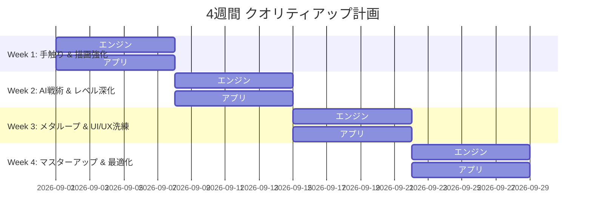

# 『Escape from Duckov』クオリティアップ・ロードマップ（4週間計画）

本ドキュメントは、アルファ版が完成したゲームエンジン **Baziru3_Engine** およびゲームアプリケーション **Escape from Duckov** を、製品版・ポートフォリオ提出レベル（ベータ〜マスター版）へ引き上げるための設計指針・アドバイス・4週間の詳細実装計画書です。

---

## 1. 全体目標と基本方針

* **目標**: 「機能が動く」アルファ版から、「遊んでいて手触りが最高に気持ちよく、緊迫感と達成感がある」マスター版への昇華。
* **期間**: 4週間（Week 1 〜 Week 4）
* **工数配分**: エンジン層 40% ／ アプリケーション層 60%
* **ターゲットフレームレート**: 60 FPS（1920x1080）常時維持

---

## 2. エンジン層（Baziru3_Engine）強化指針

脱出シューターというジャンルにおいて、**「光と影（暗闇の緊迫感）」「音（索敵の生命線）」「安定したフレームレート」** は没入感に直結します。

```
[Baziru3_Engine]
 ├── Graphics
 │    ├── Shadow Mapping (深度シャドウ) ── 遮蔽物・敵の立体感向上
 │    ├── Point Light (点光源) ────────── マズルフラッシュ・爆発・環境灯
 │    └── PostProcess (Bloom/Tonemap) ── 発光演出・ミリタリー調色補正
 ├── Audio
 │    └── 3D Spatial Audio ──────────── 距離減衰・左右パンニングによる索敵
 ├── Rendering Performance
 │    └── Instancing Draw ───────────── プロップ一括描画による60FPS安定化
 └── Profiler / Diagnostic
      └── Frame Time & DrawCall Tracker ─ ボトルネック即時検知
```

### ① シャドウマップ（Shadow Mapping）と多光源（Point Light）
- **シャドウマップ**: ライト視点の深度テクスチャを作成し、ピクセルシェーダーで遮蔽判定。角の向こうに潜む敵やオブジェクトの接地感を大幅向上。
- **ポイントライト（Point Light）**: 座標と減衰半径を持つ点光源定数バッファを導入。マズルフラッシュ（射撃の瞬間のみ点灯）、爆発の閃光、脱出ビーコンを動的に照らす。

### ② ポストプロセスチェーン（Bloom & カラーグレーディング）
- **ブルーム（Bloom）**: 輝度抽出バッファ $\rightarrow$ ガウスダウンサンプリング $\rightarrow$ 加算合成で、マズルフラッシュや金の鴨像、サーチライトを高品位に発光。
- **カラーグレーディング / トーンマップ**: 殺伐としたミリタリー調の冷たいルックや、瀕死時のコントラスト低下・赤点滅をポストプロセスで一括制御。

### ③ 3D空間音響（距離減衰・パンニング）
- リスナー（プレイヤー）と音源（敵の足音・銃声）の3D距離に応じた **音量減衰（Linear / Inverse Falloff）** と **左右パン（Stereo Panning）** をエンジン側で計算。足音による索敵のゲーム性を担保。

### ④ インスタンシング描画（DrawIndexedInstanced）
- 同じメッシュ（木箱、ドラム缶、フェンス、草木等）のワールド変換行列をStructuredBuffer / インスタンスバッファにまとめ、ドローコールを削減。

---

## 3. アプリケーション層（Escape from Duckov）強化指針

ゲームの「手触り（Juice）」「緊張感」「リプレイ性」を最大化します。

```
[Application Layer]
 ├── Combat & Juice (手触り)
 │    ├── Muzzle Flash & Ejection ───── 射撃時の光・物理薬莢跳ね返り
 │    ├── Impact Juice ──────────────── 怯みアニメ・血痕/火花・頭部クリティカル音
 │    └── Locomotion Feel ───────────── 移動慣性・カメラボビング・回避スピード感
 ├── Tactical Enemy AI
 │    ├── 3-Phase Detection ─────────── 巡回(？) → 警戒(索敵) → 発見(！)
 │    └── Archetypes ────────────────── 突撃ショットガン兵 / 遠距離狙撃兵 / 重装ボス
 ├── Extraction Drama
 │    ├── Siren & Reinforcement ─────── 脱出カウント中の警報と増援ラッシュ
 │    └── Interactive Props ─────────── 爆発ドラム缶・鍵付き金庫
 └── Meta-Loop & UI/UX
      ├── Raid Result Screen ────────── 獲得ルーブル・生還ランク・スタッシュ加算
      └── Danger Feedback ───────────── 瀕死時の心拍音・画面赤鼓動・息切れ
```

### ① 射撃・移動の「Juice（ゲームフィール）」徹底強化
- **射撃**: マズルフラッシュ点光源 ＋ 薬莢（Casing）物理バウンド ＋ クロスヘアの拡散・反動（リコイル）。
- **着弾**: ヒットストップ（敵被弾時に1〜2フレーム停止）、血痕デカール・火花、ヘッドショット時の「カキーン！」という爽快な金属キル音。
- **移動**: スプリント時の微小なカメラボビング（上下揺れ）とFOV拡大、ローリング回避時の残像・スピードライン同期。

### ② 敵AI（BehaviorTree）の戦術バリエーション
- **状態表示**: 頭上に警戒アイコン（「？」＝足音感知・捜索、「！」＝発見・射撃開始）と専用SE。
- **敵タイプの差別化**:
  1. **Assault Duck**: 遮蔽物を使いながら中距離からアサルトライフル連射。
  2. **Shotgun Rusher**: プレイヤーに急接近し大ダメージを与える近接特化。
  3. **Sniper Duck**: 赤いレーザーサイトで狙撃予告を行い、高威力の単発射撃。
  4. **Heavy Boss (Killa Duck)**: 重装甲、グレネード投擲、高耐久のエリアボス。

### ③ エクストラクション（脱出）のドラマとギミック
- **脱出アラーム**: 脱出パッドに入るとサイレン警報が鳴り、周囲の敵が一斉に集結するラストスタンド展開。
- **爆発ドラム缶**: 撃つと周囲の敵を巻き込んで大爆発（吹き飛びパーティクル＋大揺れカメラ）。

### ④ メタループ（リザルト・経済）とUI演出
- **レイドリザルト画面**: 生還（EXTRACTED）/ 死亡（MIA/KIA）、持ち帰ったルーブル（₽）の集計、撃破スコア、生還ランク評価。
- **ピンチ演出**: 残りHP 25%以下で画面端が赤くドクンドクンと鼓動し、心拍音と息切れが再生。

---

## 4. 4週間 詳細スケジュール & マイルストーン



### 第1週（Week 1）：手触り（Juice）とビジュアル基礎の強化
> **マイルストーン：『1発撃つだけで圧倒的に気持ちいい状態』の確立**

| 担当 | タスク内容 | 完了条件・検証基準 |
| :--- | :--- | :--- |
| **エンジン** | ・Point Light（点光源）定数バッファとシェーダ対応<br>・Bloom（高輝度抽出＋ブラー加算）ポストプロセス | 任意の3D座標に点光源を配置・点滅でき、高輝度部分が自然に発光すること |
| **アプリ** | ・射撃時マズルフラッシュ光源同期 ＆ 薬莢放出パーティクル<br>・敵着弾フィードバック（ヒットストップ、怯み、火花/血痕）<br>・クリティカル（頭部）ヒット時の専用SEと大揺れカメラ<br>・移動/回避時のカメラボビング・スピード感調整 | 射撃とヒットの手応えが劇的に向上し、操作していて爽快感があること |

---

### 第2週（Week 2）：敵AIタクティクスとレベルギミックの深化
> **マイルストーン：『状況判断と立ち回り』が求められるタクティカル戦闘の完成**

| 担当 | タスク内容 | 完了条件・検証基準 |
| :--- | :--- | :--- |
| **エンジン** | ・3D空間音響（音源距離に応じた音量減衰・左右パンニング）<br>・簡易シャドウマップ（Directional Lightからの深度影） | 画面外の敵の足音や銃声から方向と距離が判別でき、オブジェクトの影が落ちること |
| **アプリ** | ・敵AI警戒状態（「？」/「！」アイコン表示・索敵挙動）<br>・敵バリエーション実装（突撃ショットガン兵、遠距離スナイパー）<br>・インタラクティブギミック（撃つと爆発するドラム缶）<br>・レベルエディタでの遮蔽物・巡回ルートの再配置 | 敵の行動にメリハリが生まれ、ステルス・射撃・ギミック利用の選択肢ができること |

---

### 第3週（Week 3）：ゲームループ（経済・脱出）とUI/UXの洗練
> **マイルストーン：『潜入 $\rightarrow$ 探索 $\rightarrow$ 激戦 $\rightarrow$ 脱出 $\rightarrow$ 報酬獲得』の完全成立**

| 担当 | タスク内容 | 完了条件・検証基準 |
| :--- | :--- | :--- |
| **エンジン** | ・プロップのインスタンシング描画（DrawIndexedInstanced）<br>・CPU/GPUフレームタイム・ドローコール計測UI整備 | 障害物やプロップが100個以上配置されてもドローコールが削減され、処理落ちしないこと |
| **アプリ** | ・脱出ゾーン要請時のサイレン警報 ＆ 増援ラッシュ演出<br>・レイドリザルト画面（獲得ルーブル・生還ランク・戦績表示）<br>・瀕死時演出（画面端赤鼓動 ＋ 心拍音SE ＋ 息切れ）<br>・物資（金の鴨・医療キット・弾薬）取得時の演出洗練 | 1レイドの緊張感と生還時の達成感が最大化され、リザルトで満足感が得られること |

---

### 第4週（Week 4）：マスターアップ・最適化・最終ポリッシュ
> **マイルストーン：製品版クオリティ・公開可能マスター版の完成**

| 担当 | タスク内容 | 完了条件・検証基準 |
| :--- | :--- | :--- |
| **エンジン** | ・DirectX12リソースリークの完全ゼロ化<br>・リリースビルドの最適化、例外/クラッシュ耐性の強化 | 長時間プレイやシーン切り替えを繰り返してもメモリ使用量が一定で、クラッシュしないこと |
| **アプリ** | ・ゲームバランス調整（敵HP・ダメージ、弾薬数、物資出現率）<br>・全体サウンドバランス（BGM・SE・環境音・ボイス）の最終ミックス<br>・チュートリアル看板/操作ガイドのわかりやすさ向上<br>・PV・スクリーンショット撮影用フリーカメラ機能 | 初見プレイヤーが迷わず操作でき、理不尽さを感じずにスリリングに楽しめること |

---

## 5. チェックリスト & 品質判定基準（Definition of Done）

- [ ] **安定動作**: 60FPSを下回る場面がなく、Scene遷移やリスタートでメモリリーク・クラッシュが起きない。
- [ ] **手触り**: 射撃、被弾、リロード、回避、移動のすべてに視覚・聴覚フィードバックがある。
- [ ] **AIと戦闘**: 敵がただ棒立ちや直線追従するのではなく、索敵・カバー・突撃の役割を果たす。
- [ ] **ループの完結**: タイトル $\rightarrow$ 出撃 $\rightarrow$ 探索 $\rightarrow$ 脱出防衛 $\rightarrow$ リザルト $\rightarrow$ スタッシュが滑らかに繋がる。
- [ ] **第一印象の迫力**: 影・ブルーム・ポストプロセスにより、スクリーンショット1枚で世界観とクオリティが伝わる。
