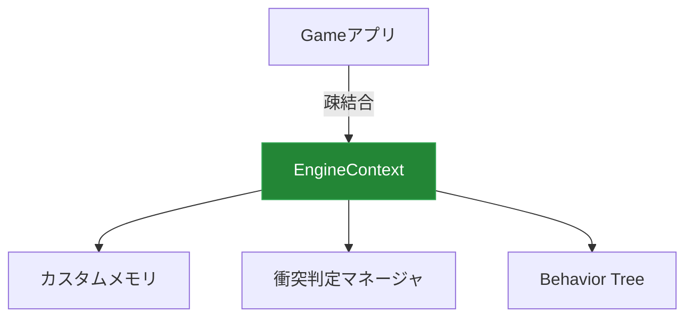
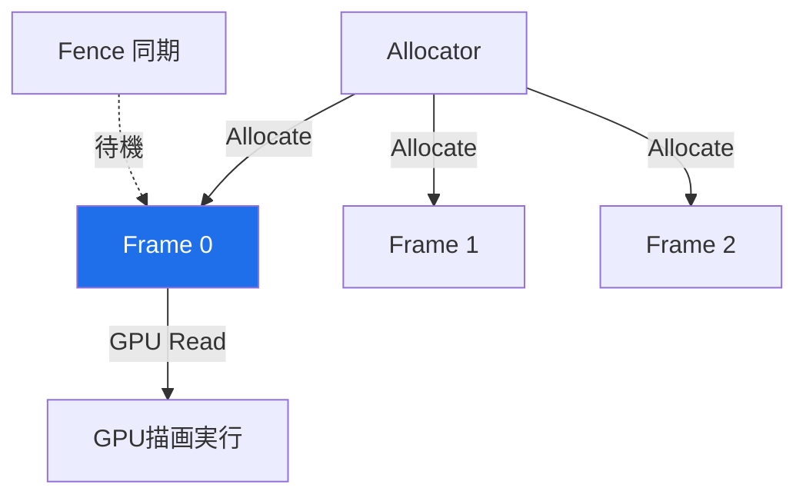
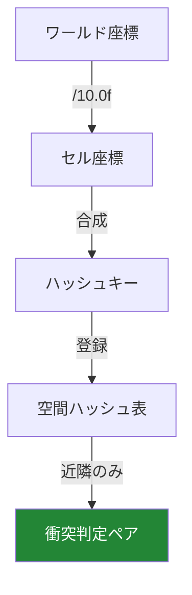
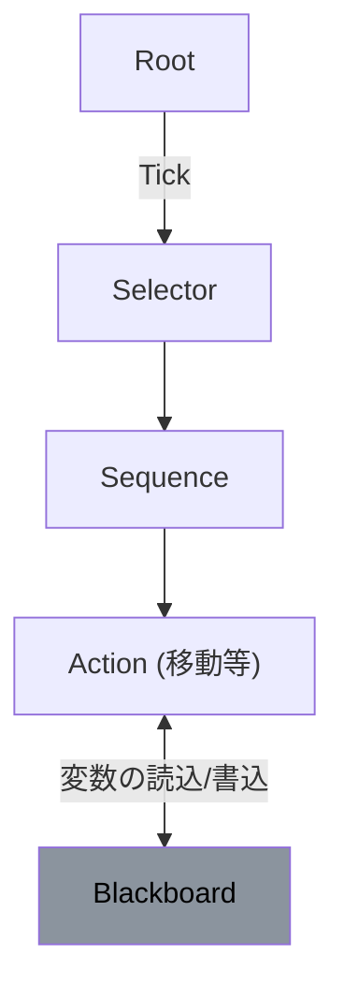
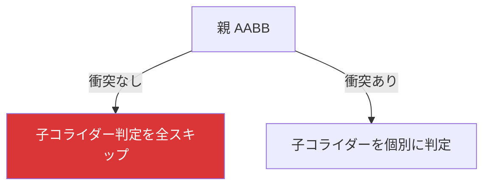

# 自作3Dゲームエンジンにおける
# 「動的物理とメモリ最適化」の実装

### 個人製作ポートフォリオ技術発表資料

**LE3B_09_コウダ_アユ**

---

## 1. プロジェクトの概要

<div class="grid-2">
<div>

* **自作エンジン「Baziru3 Engine」**
  * C++ & DirectX 12 でスクラッチ開発。
* **テーマ：動的物理とメモリの最適化**
  * コライダー、AI、メモリを低レイヤで結合。
  * コンソール開発で最重要となる**「動的確保の排除」**と**「計算量削減」**を実証。
</div>
<div>


</div>
</div>

<footer>1/12</footer>

---

## 2. 解決すべき技術的課題

### 多数のキャラクターや精密判定を同時動作させるための負荷対策

* **課題1：動的メモリ確保（new/delete）の負荷**
  * 毎フレームのリソース生成によるメモリ断片化とフレームレート低下の防止。
* **課題2：衝突判定の計算爆発 ($O(N^2)$)**
  * オブジェクト数増加に伴う、総当たり当たり判定の処理重化。
* **課題3：開発調整イテレーションの遅さ**
  * パラメータやAIロジック変更のたびに再コンパイルが発生する。

<footer>2/12</footer>

---

## 3. メモリ：定数バッファアロケータ

<div class="grid-2">
<div>

* **課題：毎フレームの定数バッファ生成負荷**
* **対策：`ConstantBufferAllocator`**
  * **一括確保**: 3フレーム分のバッファを事前に確保。
  * **アライン調整**: 256バイト境界に合わせ、アドレスをポインタ前進のみで高速切り出し。
  * **同期**: GPU読み込み領域の上書きを防ぐフェンス同期。
* **効果**: 実行時アロケーションを完全排除。
</div>
<div>


</div>
</div>

<footer>3/12</footer>

---

## 4. メモリ：スタックアロケータ

<div class="grid-2">
<div>

* **課題：更新ループ中の一時メモリ確保負荷**
* **対策：`StackAllocator` の実装**
  * **プール化**: 起動時に一括でメモリプールを確保。
  * **$O(1)$ アロケート**: ポインタをサイズ分だけ前進させて高速に切り出す。
  * **$O(1)$ 一括解放**: フレーム終了時にポインタを先頭に戻すだけで全データを解放。
* **効果**: 個別 `delete` のオーバーヘッドをゼロ化。
</div>
<div>

```mermaid
gantt
    title StackAllocator メモリイメージ
    dateFormat  X
    axisFormat %s
    section メモリ領域
    使用中領域 (O(1) アロケート) :active, 0, 45
    未使用領域 : 45, 100
    ※フレーム終了時にポインタを「0」にリセット
```
</div>
</div>

<footer>4/12</footer>

---

## 5. 物理：空間ハッシュによる衝突判定最適化

<div class="grid-2">
<div>

* **課題：オブジェクト増加による判定負荷**
* **対策：`SpatialHashCell`（空間ハッシュ）**
  * ワールド空間を `10.0f` ごとの3Dセルに分割。
  * 座標からハッシュキーを算出してセルへ登録。
  * 同一セルおよび隣接セル内のみで衝突判定。
* **効果**: 判定回数を削減し、計算量をほぼ $O(N)$ へ。
</div>
<div>


</div>
</div>

<footer>5/12</footer>

---

## 6. 物理：データ指向設計（DOD）

<div class="grid-2">
<div>

* **課題：オブジェクト指向によるキャッシュミス**
* **対策：`CollisionData` の連続配置**
  * クラス（ポインタ）参照を排除。
  * 判定に必要なパラメータ（座標、半径等）のみを構造体配列に抽出。
  * 連続した配列を単純ループで一括バッチ処理。
* **効果**: CPUキャッシュミスを低減しメモリバス負荷を極小化。
</div>
<div>

```mermaid
graph LR
    subgraph キャッシュミス多 (OOP)
        O1[Obj1ポインタ] --> D1[データ1]
        O2[Obj2ポインタ] --> D2[データ2]
    end
    subgraph キャッシュ効率化 (DOD)
        DOD[連続メモリ: Data1 | Data2 | Data3]
    end
    style DOD fill:#238636,color:#fff
```
</div>
</div>

<footer>6/12</footer>

---

## 7. 精密な衝突判定と多様なコライダー形状

<div class="grid-2">
<div>

* **あらゆるゲームインタラクションへの対応**
* **多様なコライダータイプ**:
  * **Sphere / Box (OBB・AABB) / Capsule**
  * **Mesh コライダー**: ポリゴン単位の精密交差判定。
  * **Skeleton コライダー**: 関節連動による当たり判定。
* **拡張機能**: 
  * **レイキャスト (Raycast)**: 高速な視界・射線判定。
  * **トリガーライフサイクル**: `OnTriggerEnter/Stay/Exit`
</div>
<div>

```mermaid
graph TD
    Collider --> Sphere
    Collider --> Box
    Collider --> Capsule
    Collider --> Mesh[Mesh (ポリゴン精密)]
    Collider --> Skeleton[Skeleton (関節連動)]
    style Mesh fill:#1f6feb,color:#fff
    style Skeleton fill:#1f6feb,color:#fff
```
</div>
</div>

<footer>7/12</footer>

---

## 8. AIシステム：Behavior Tree ＆ Blackboard

<div class="grid-2">
<div>

* **課題：AI調整におけるビルド時間のロス**
* **対策：ビジュアルエディタとデータ駆動**
  * **Behavior Tree**: 階層的ノードによる意思決定。
  * **Blackboard**: 個体用共有メモリ。
  * **GUIエディタ**: `imgui-node-editor` を統合。
  * ランタイムで接続・パラメータを編集し、JSON出力。
* **効果**: コンパイルなしでAIの即時調整を実現。
</div>
<div>


</div>
</div>

<footer>8/12</footer>

---

## 9. 敵AIの行動仕様と動的インタラクション

* **1. Patrol（巡回・監視）**
  * ルートパトロール、および首振りによる視界スキャン。
* **2. Investigate（捜索）**
  * 銃声や足音（音リソース）の発生源へ移動し、周辺を捜索。
* **3. Chase（戦闘・カバーアクション）**
  * ターゲット追従。
  * **カバー判定**: レイヤー上の遮蔽物情報を取得し、射線が通らない「壁の裏側（セーフ領域）」を算出して退避。
  * **ピーク射撃**: 遮蔽物から身を乗り出して射撃を行い、クールダウン時は再び隠れる。

<footer>9/12</footer>

---

## 10. 経路探索（NavMesh）と負荷削減（BVH）

<div class="grid-2">
<div>

* **障害物の賢い回避と計算負荷の削減**
* **NavMesh 経路探索**
  * 3D地形成分から歩行可能床エリアを抽出。
  * $A^*$（エースター）アルゴリズムを用いて、障害物を迂回する最短経路をリアルタイム計算。
* **BVH（境界ボリューム階層）による枝刈り**
  * コライダー群を階層的にAABB（境界箱）で包絡。
  * 親AABBと非衝突なら、内包される子オブジェクトの判定計算を早期スキップ。
</div>
<div>


</div>
</div>

<footer>10/12</footer>

---

## 11. デバッグ・計測システム：ボトルネック特定

* **GPUプロファイラ (GpuProfiler)**
  * DirectX 12 タイムスタンプクエリをコマンドリストに挿入。
  * シャドウパス、メイン描画、ポストエフェクト等のGPU処理時間をミリ秒で正確に測定・ImGuiへ視覚化。
* **リアルタイムデバッグ描画**
  * `CollisionManager::DrawDebug` にて、空間に配置された全コライダー（精密メッシュ等）のワイヤーフレームをリアルタイム描画。
* **CPUリークチェッカー ＆ 例外ダンプ生成**
  * 起動〜終了時のメモリリーク検出、異常終了時のレポート生成。

<footer>11/12</footer>

---

## 12. まとめと今後の展望

* **低レイヤ制御の実践**
  * DirectX 12 デバイス、各種バッファ割り当て、およびCPU-GPU間の同期フェンス制御を体系的に設計。
* **コンソール実務レベルの最適化手法の習得**
  * 動的確保の排除、空間分割（ハッシュ・BVH）、連続メモリへのデータ指向アプローチ（DOD）を適用。
* **今後のロードマップ**
  * アセットファイルのコンバート（独自バイナリ化）とマルチスレッド非同期ロードの実装。

**ご清聴ありがとうございました。**

<footer>12/12</footer>
